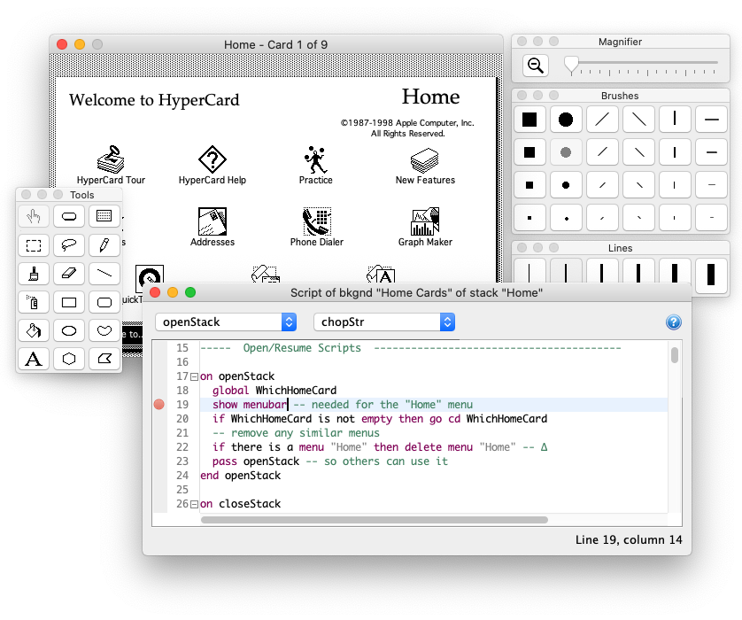
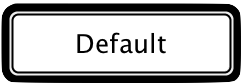
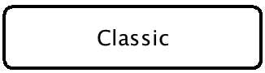
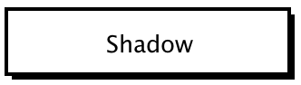
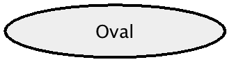
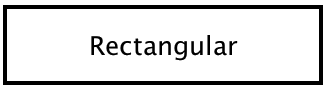
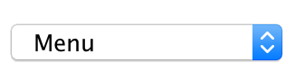
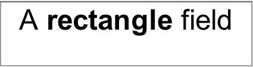
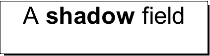
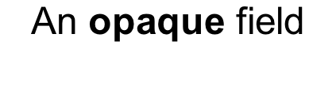

# HyperTalk Java

An effort to recreate Apple's HyperCard in Java. Originally developed as a class project for a graduate-level compiler design course at DePaul University in Chicago.



#### Wait, what's HyperCard?

Released in 1987 and included in the box with every Macintosh sold during the late 1980's and '90s, HyperCard was a software [Erector Set](https://en.wikipedia.org/wiki/Erector_Set): part programming language, part paint program, part database. With HyperCard, you could draw a user interface with [MacPaint](https://en.wikipedia.org/wiki/MacPaint)-like tools, then apply scripts and behaviors to it with an expressive syntax that mimicked natural English.

Apple called it "programming for the rest of us." Steve Wozniak called it ["the best program ever written"](https://www.macworld.com/article/1018126/woz.html).

[Watch an interview of HyperCard's creators](https://www.youtube.com/watch?v=BeMRoYDc2z8) Bill Atkinson and Dan Winkler on The Computer Chronicles, circa 1987. Or, watch a screencast tutorial [here](https://www.youtube.com/watch?v=AmeUt3_yQ8c).

## Features

HyperTalk Java attempts to maintain high-fidelity to Apple's original software. By and large, HyperTalk Java has been an effort to clone the original, not to contemporize it.  

#### Organize information

* Create, open, and save stacks of cards that can contain text, graphics, buttons, menus, sounds, and animations.
* Supports foreground and background layers; styled buttons and fields similar to HyperCard's; text fields can hold richly styled text.
* Read and write text files from script; print individual cards and stacks of cards.

#### Paint and draw

* Use any of HyperCard's original paint tools, patterns, and 2D image transforms (all provided by the [JMonet library](https://www.github.com/defano/jmonet)).
* Full-color graphics with alpha transparency, plus the ability to reduce color depth to give images a more "vintage feel."
* Drag-and-drop graphics onto the card; import and export graphics using the "Import Paint" / "Export Paint" menu commands.
* Includes many of the original button icons, plus the ability to create new icons from paint selections.

#### Script your own software

* Attach scripts to buttons, fields, cards, backgrounds and stacks; messages follow HyperCard's message passing order and can be trapped to override system behavior.
* Supports much of the HyperTalk 2.2 language (almost all of the built-in commands and functions have been implemented).
* Customize the application menu bar; author scripts that determine behavior of menu items.
* Powerful expression language sports compound mutable chunk operations (`put the first word of "Hello World" after the second item of the third line of card field "data"`).

#### Play with sounds and effects

* Play HyperCard's original sound effects (`flute`, `harpsichord` and `boing`), and `dial` telephone numbers.
* Synthesize sounds into a sequence of musical notes; supports pitch, octave, accidental, duration and tempo.
* Animate cards and parts by locking and unlocking the screen with one of 23 animated visual effects (provided by the [JSegue library](https://www.github.com/defano/jsegue)).

### Notable absences

This is neither a HyperCard replacement nor an open-sourced release of Apple's software. HyperTalk Java is still missing quite a few features present in HyperCard:

* Can't open or import old HyperCard stacks. Maybe in the future...
* No multi-window stack support (`open stack ... in new window`), or palettes.
* No Home stack; no concept of user levels; no ability to inherit behavior from other stacks (`start using ...`).
* No support for external commands or functions (XCMDs/XFCNs).
* Many commands, functions, and properties have not yet been implemented.

## Getting started

Getting started is easy. What is it that you're interested in doing?

#### I want to download and play with this.

Lucky for you, an executable will be available for download soon.

#### I'm a Java developer and want to contribute to the source code.

Glad to have you aboard! Have a look at [the build instructions](doc/BUILDING.md).

#### I don't care about your dumb homework assignment. I want to run the real HyperCard.

Use the SheepShaver emulator to run Macintosh System Software on newer Macs and PCs. See [this tutorial](https://jamesfriend.com.au/running-hypercard-stack-2014) for details.

#### I'm an attorney and I'm looking for new work.

This project represents a homework assignment gone awry and is in no way associated with Apple's long-obsolete HyperCard application program. HyperCard&trade;, HyperTalk&trade; and any other trademarks used within are the property of FileMaker, Inc., Apple, Inc. and/or their rightful owner(s).

# The HyperTalk Language

[Stacks](#stacks-of-cards) | [Messages](#messages-and-handlers) | [Expressions](#expressions) | [Variables](#containers) | [Parts](#parts-and-properties) | [A/V Effects](#audio-visual-effects) | [Commands](#commands) | [Functions](#functions) | [Flow Control](#control-structures)

HyperCard's native language, _HyperTalk_, is an event-driven scripting language. Scripts are attached to user interface elements called _parts_ and are triggered by user actions called _events_. (There is no singular "main" script in HyperTalk.)

HyperTalk is a [duck-typed](https://en.wikipedia.org/wiki/Duck_typing) language. Internally, each value is stored as a string of characters and converted to a number, boolean, or list depending on the context of its use. HyperCard does not allow nonsensical conversions: Adding `5` to `hello` produces a syntax error.

Keywords and symbols (variables) in the HyperTalk language are case insensitive. Thus, `ask "How are you?"` is the same as `ASK "How are you?"`; a variable named `myVar` is no different from `myvar`. Comments are preceded by `--`.

A simple script to prompt the user to enter their name then greet them might look like:

```
-- This is my first script

on mouseUp
  ask "Tell me your name" with "I'd rather not"

  if it is "I'd rather not" or it is empty then
    answer "Then I can't very well say hello, can I?"
  else
    put "Hello " && it into greeting
    answer greeting with "Why, thanks!"
  end if

end mouseUp

```

Although indentation and most whitespace is ignored, newlines have meaning in the syntax and are somewhat analogous to semicolons in C-like languages. Statements must be separated by a newline, and a single statement cannot typically break across multiple lines.

For example, this is legal:

```
answer "How are you today" with "Pretty good" or "Stinky!"
```

... but this is not:

```
answer "How are you today" with
  "Pretty good" or
  "Stinky!"
```

Apple's HyperCard supported a newline character (_logical negation_ symbol, [Unicode U+00AC](https://en.wikipedia.org/wiki/Latin-1_Supplement_(Unicode_block))) that could be used to break a long statement across multiple lines but this implementation does not.

As you enter script text into the script editor or message box, HyperTalk Java will flag syntax errors as you type by underlining the offending text with a red squiggle.

## Stacks of Cards

A HyperCard stack is made up of one or more cards arranged in an ordered list with only one card visible to the user at any given time (like slides in a PowerPoint deck). When the user navigates from one card to another, the contents of the new card appear in place of the old card (and the transition may be animated using a _visual effect_).

Every card is comprised of two layers of graphics and user interface elements: a background layer and a foreground layer (called the _card layer_). Each card has its own unique foreground, but its background can be shared between cards. A background may contain graphics, buttons, text fields and scripts that are common to multiple cards in a stack. A stack may have multiple backgrounds.

### Navigating between cards

Navigate between cards in the stack using commands in the "Go" menu ("First", "Next", "Prev" and "Last") or use the HyperTalk `go` command:

```
go to card "MyCard" -- navigates to next card named "MyCard"
go to card 13       -- no effect if there are fewer than 13 cards
go next card
go to the third card
go to card id 7
```

You can also navigate to a card based on its background,

```
go to the next background  -- next card in the stack with a different background than current card
go to background 3         -- first card with the third unique background in the stack
```

## Messages and Handlers

Stacks, backgrounds, cards, buttons and fields can be scripted in the HyperTalk language. A script is a set of _handlers_ and _functions_ that describe how the part reacts when HyperCard (or another script) sends a message to it. A _handler_ handles incoming messages; a _function_ is a subroutine that optionally returns a value to its caller.

For example, a button could contain the script:

```
on mouseUp
  answer "Hello World" with "Why, thank you."
end mouseUp
```

In this example, when the user clicks the button containing this script, the action of the mouse button being released over the part causes HyperCard to send the message `mouseUp` to the button. Upon receipt of this message, the button executes its `mouseUp` handler (which, in turn, generates a "hello world" dialog box).

HyperTalk Java automatically sends the following messages to parts as the user interacts with the stack:

 Event Message      | Description
--------------------|-----------------------------------------------------------------------------
 `choose`           | Sent to the current card when the tool selection changes; passes the tool name and number as arguments, for example, `choose "Brush", 7`
 `doMenu`           | Sent to the current card when the user chooses a menu from the menu bar; passes the menu and menu item name as arguments to the message, for example, `doMenu "Edit", "Undo"`
 `mouseUp`          | Sent when the mouse is pressed and released over a part
 `mouseDown`        | Sent when the mouse is pressed over a part
 `mouseDoubleClick` | Sent when the mouse is double-clicked over a part
 `mouseEnter`       | Sent when the cursor enters the bounds of a part
 `mouseLeave`       | Sent when the cursor leaves the bounds of a part
 `keyDown`          | Sent when a key is typed over a focused part; sends the key as an argument to the message, for example, `on keyDown theKey`
 `arrowKey`         | Sent when an arrow key is pressed; sends the arrow key's direction as an argument to the message (`on arrowKey direction`, where `direction` is one of `up`, `down`, `left` or `right`)
 `commandKeyDown`   | Sent when the command key (or the _meta_ key, on non-macOS systems) is pressed
 `controlKey`       | Sent when the control key is pressed
 `enterKey`         | Sent when the enter key is pressed
 `enterInField`     | Sent when the enter key is pressed while typing in a field
 `returnInField`    | Sent when the return key is pressed while typing in a field
 `functionKey`      | Sent when a function (i.e, F1) key is pressed; sends the number of the function key as its argument (`on functionKey whichKey`, where `whichKey` is a number between 1 and 12).
 `idle`             | Periodically sent to the current card when there are no other scripts executing.
 `returnKey`        | Sent when the return key is pressed
 `tabKey`           | Sent when the tab key is pressed

Messages do not have to originate from HyperCard, nor are they limited to those listed in the table above. A script may send a message of its own creation to another part (or to itself) using the `send` command.

For example:

```
send mouseUp to button 1   -- Make 'button 1' act as though user clicked it
send doSomethingCool to field "myField" -- call the 'on doSomethingCool' handler
```

Alternately, a message can be sent directly to the current part by invoking the message name with an optional list of arguments, for example:

```
doSomethingCool                                   -- invokes the on doSomethingCool handler with no arguments
doSomethingComplex "Some Value", "Another Value"  -- invokes handler with two arguments
```

Parts do not need to implement a handler for every message they might receive. Messages for which there are no handler are simply ignored.

### Message passing order

Messages follow a _message passing order_. If a part receives a message and does not have a handler to handle it (or, if its handler invokes the `pass` command) then the message is forwarded to the next part in the sequence.

Messages follow this order:

**Buttons** and **fields** pass messages to the **card** or **background** on which they appear; a card passes messages to its **background**; and a background passes messages to its **stack**. If the stack does not trap the message, the message is passed back to **HyperCard** which handles the message itself.

This architecture lets parts "override" certain HyperCard behaviors by trapping the associated event message (like overriding the behavior of a what a given menu item does by trapping the `doMenu` message).

For example, add the following script to a field to disallow entry any of any character other than an even number:

```
on keyDown theKey
  if theKey is a number and theKey mod 2 is 0 then pass keyDown
end keyDown
```

This works by passing the `keyDown` through the message passing order only when the pressed key (`theKey`) is a number that is evenly divisible by 2. By implementing a `keyDown` handler and only conditionally passing the `keyDown` message back to HyperCard (`pass keyDown`), the script can "steal" these key press events and prevent their normal behavior (which would be to add the character to the field).

You could prevent the user from choosing a tool on the tool palette by trapping the `choose` message. For example,

```
on choose theTool, toolNumber
  if theTool is "lasso" then answer "Sorry, the lasso is currently on strike."
  else pass choose
end choose
```

Additionally, anytime a command is executed in HyperTalk a message of the same name is sent to the current card, providing the same capability for trapping command behavior. Adding the following script to a card, background or stack prevents the `subtract` command from doing its job:

```
on subtract
  answer "Wouldn't you rather add?" with "Yes" or "No"
  if it is not "Yes" then pass subtract
end subtract
```

## Expressions

An expression is anything in HyperTalk that represents (or produces) a value. Constants (like `3.14`, `quote` or `"Hello world!"`), containers and variables (`myVar`, `the message window`, `card field 1`), operators (`2 + 2`, `p is within r`) and functions (`the date`, `fibonacci(empty, 0, 1, 200)`) are all expressions.

Perhaps the most powerful aspect of HyperTalk's expression language is its ability to address a portion of an expression (called a _chunk_). A script can get or set any range of words, characters, lines, or (comma-delimited) items in a value by specifying them numerically (`line 3 of`), by ordinal (`the third line of`), or relatively (`the last line of`; `the middle word of`).

Consider the following chunked expressions:

```
the first character of the second word of the last line of field id 24
character 19 to 27 of the message box
the second item of "Hello,Goodbye" -- yields "Goodbye"
the middle word of "one two three" -- yields "two"
```

When mutating a chunk of text within a container, a preposition (`before`, `into`, or `after`) may be included in the expression. For example:

```
put word 2 of "Hello Goodbye" into the first word of field id 0
put "blah" after the third character of the middle item of myVar
put 29 before the message box
```

Chunks may be used as terms in an expression to produce powerful and easy-to-understand logic:

```
multiply the first character of card field "numbers" by 9
if item 1 of the mouseLoc > item 2 of the mouseLoc then answer "Move left, captain!"
sort the lines of bkgnd field 3 by the last word of each
```

Want to impress your friends? HyperTalk lets you to modify a chunk-of-a-chunk inside a container. For example:

```
put "x" into the second character of the third word of the fourth line of field id 1
put the first char of the second word of myContainer into the middle item of the last line of y
```

Some examples of valid expressions include:

```
item 1 of the mouseLoc < 100 -- true if the mouse is towards the left of the card
4 * (2 + 3) -- yields 20
"hello" contains "el" and "goodbye" contains "bye" -- true
3 * 5 is not 15 -- false
"Hello" && "World" -- produces "Hello World"
"Hyper" > "Card" -- true, "Hyper" is alphabetically after "Card"
not "nonsense" -- syntax error, "nonsense" is not a boolean
false is not "tr" & "ue" -- true, concatenating 'tr' with 'ue' produces a logical value
```

### Operators

An operator is an expression that takes one (unary) or two (binary) values, applies some _operation_ to them, and yields a new value. HyperTalk supports a standard suite of mathematical, logical and string operators:

|Precedence  | Operator        | Description
|------------| ----------------|-------------
|1 (highest) | `( )`           | Grouping
|2           | `-`             | Negation for numbers (unary)
|            | `not`	         | Negation for boolean values (unary)
|3           | `^`             | Exponentiation for numbers
|4           | `*`             | Multiplication for numbers
|            | `/`             | Division for numbers
|            | `div`	         | Division for numbers
|            | `mod`	         | Modulus division for numbers; returns the remainder
|5           | `+`             | Addition for numbers
|            | `-`             | Subtraction for numbers
|6           | `&`, `&&`       | Text concatenation; `&&` adds a space between operands; `&` does not
|7           | `>`             | Greater than comparison for numbers and text
|            | `<`             | Less than comparison for numbers and text
|            | `<=`            | Less than or equal to comparison for numbers and text
|            | `>=`            | Greater than or equal to comparison for numbers and text
|            | `contains`      | Substring comparison for text
|            | `is a`, `is an` | Determines if the left-hand value is a `number`, `integer`, `date`, `point`, `rect` (or `rectangle`), `logical` (or `boolean`, `bool`). Returns an error if the right-hand value is not an expression yielding one of these types.
|            | `is not a`, `is not an` | The logical inverse of `is a`, `is an`
|8           | `=`             | Equality comparison for text
|            | `is`            | Equality comparison for text
|            | `is not`        | Negative equality comparison for text
|            | `<>`	           | Synonym for is not
|9           | `is within`     | Determines if the left-hand point value is contained within the right-hand rectangle value.
|            | `is not within` | Determines if the left-hand point value is not contained within the right-hand rectangle value.
|10          | `and`           | Logical AND for boolean values
|11 (lowest) |  `or`           | Logical OR for boolean values

### Factors

A _factor_ is an evaluated term or operand appearing in an expression. To eliminate ambiguity, HyperCard uses the following precedence when evaluating factors:

Precedence   | Term                    | Description
-------------|-------------------------|------------
1 (highest)  | _Constant_              | Evaluation of a built-in constant (e.g., `pi`); see table below
2            | _Built-in Function_     | Evaluation of a built-in function (e.g., `the mouse`)
3            | _User-defined Function_ | Evaluation of a user-defined function (e.g., `fact(10)`)
4            | _Literal_               | Evaluation of a literal value (e.g., `"Hello world!"`)
5            | _Variable Container_    | Evaluation of a variable container (e.g., `x` in `get x + 3`)
6            | _Part_                  | Evaluation of a part specifier (e.g., `card field id 0`)
7 (lowest)   | _Property_              | Evaluation of a property of a part (e.g., `the width of me`)

### Constants and literals

The table below lists special values that are treated as keyword constants in the language; any _unquoted_ use of these terms evaluates to the specified value.

Additionally, any single-word unquoted literal that is not a language keyword and not an in-scope variable will be interpreted as though it were a quoted string literal. For example, `put neat` displays the word "neat" unless a variable named "neat" is in scope, in which case the variable's value will be displayed.

Multi-word unquoted literals are not allowed in HyperTalk Java; `put hello world` results in a syntax error.

Constant     | Value
-------------|---------------------------------------
`empty`      | The empty string, equivalent to `""`
`pi`         | The first 20 digits of pi, `3.14159265358979323846`
`quote`      | A double-quote character, `"`
`return`     | The newline character (`\n` in Java)
`space`      | A single space, equivalent to `" "`
`tab`        | A tab character
`formFeed`   | The form feed character (ASCII 0x0c, `\f` in Java)
`lineFeed`   | The line feed character (ASCII 0x0a, `\n` in Java)
`comma`      | The comma character, `,`
`colon`      | The colon character, `:`
`zero`..`ten`| The integers `0` to `10`

## Containers

A _container_ is anything in HyperCard that you can `put` a value into: Parts, variables, properties, menus and the message box are containers.

#### Variable containers

In HyperTalk, variables are implicitly declared and initialized with the empty string. Simply referring to a variable within a script "creates" that variable containing `empty` if a variable of the same name doesn't already exist. For example:

```
on mouseDown
  put "Look ma! No declaration" into theMessage  -- theMessage is a variable
  answer theMessage
end mouseDown
```

Local variables in HyperTalk are lexically scoped; they retain their value only within the handler or function in which they're used.

A variable may be made global by explicitly declaring it so with the `global` keyword. Global variables are accessible from any script anywhere in the stack, and once created, they retain their value until HyperTalk Java is quit. Note that variables that are not explicitly declared as global are considered local, even when a global variable of the same name exists.

```
--
-- Global and local variable example script
--

on mouseUp
  global fivr
  put 5 into fivr

  f()       -- call function f with no arguments
  y()       -- call function y with no arguments
end mouseUp

function f
  put fivr	-- fivr is a new local variable in this context; puts the empty string
end f

function y
  global fivr
  put fivr	-- puts "5" into the message box
end y
```

#### Part containers

Like variables, a part can also be used to store value. When placing a value into a field, the text of the field is changed. However, when placing a value into a button, card, background or stack, the part's `contents` property is changed (the `contents` property does not affect these part's appearance in any way, and can only be seen / edited from the "Info..." dialog in the "Objects" menu). One exception: When dealing with `menu` styled buttons (combo boxes), the `contents` property determines the list of menu items available in the menu.

For example:

```
put 35 + 27 into field id 12          -- Changes the text of this field to "62"
put 35 + 27 into button "My Button"   -- Changes the contents of this button to "62"
put "This is my card" into this card  -- Changes the contents of this card
put "Yes,No" into button myMenuButton -- Menu-styled button gets two menu items "Yes" and "No"
```

#### Menu containers

Every menu in the menu bar as well as buttons of the style `menu` are containers whose value specifies the items that appear in then. The value placed into a menu container is interpreted as a list of items or lines, each of which represents an item in the menu. Any `-` value in the list is interpreted as menu separator.

For example:

```
create menu "My Menu"                               -- adds a new menu to the menu bar
put "Item 1,Item 2,-,Other..." into menu "My Menu"  -- adds three items and a separator
```

The result of getting `menu "My Menu"` would produce:

```
Item 1
Item 2
-
Other...
```

#### The message box

The message box is a HyperCard window containing a single-line editable text field (you can show or hide this window from the "Go" menu). Text entered into the message is evaluated as a HyperTalk statement when you press enter. The contents of this field can by read or written as a container and is addressable as `[the] message`, `[the] message box` or `[the] message window`.

For example:

```
put "-- Add a comment" after the message box
multiply the message by 3
```

Note that the message box is HyperTalk's _default container_. That is, when a container is not explicitly specified in an expression, the message box is assumed. For example, `put "Hello"` causes the message box to be displayed and for "Hello" to appear inside of it.

#### The `it` container

HyperTalk provides an implicit variable named `it`. Most expressions and some commands place a value into this variable so that `it` refers to the last computed value.

For example:

```
on mouseUp
  get 2 * 3
  answer it   -- Responds with 6
end mouseUp
```

## Parts and Properties

A _part_ is a scriptable user interface element. Buttons, fields, cards, backgrounds and the stack itself are parts. Menus are also controllable via HyperTalk but are modeled a bit differently than other parts in HyperCard. See the section below for details about [controlling the menu bar](#menus).

Every part maintains a set of _properties_ that describe various aspects of its look-and-feel, like its size, location and style. Modifying a part's properties modifies the way the part appears and behaves.

Note that HyperTalk Java treats properties as "first class" containers which may be accessed in whole or by chunk using the `get`, `set` or `put` commands (this was not quite true in HyperCard).

### Referring to Parts

Parts may be addressed in HyperTalk by name, number, or ID, and a part can refer to itself as `me`. Use the "Button Info..." and "Field Info..." commands from the "Objects" to view the name, number and ID assigned to a part.

#### Part IDs

Each part in the stack is assigned a unique ID which never changes and will never be reused (even after the part is deleted). A part can be referred to in script by its ID. For example:

```
hide card button id 0
put "I like IDs" into background field id 22
```

#### Part Numbers

Each part is assigned a number that represents it's logical order within the context of the part's owner.

For buttons and fields, this represents the drawing order of the part (_z-order_); Higher numbered parts are drawn before lowered numbered parts and thereby appear behind them. You cannot directly set a button or field's number, but the "Bring Closer" or "Send Further" commands in the "Objects" menu will affect the number assigned to it.

For cards and backgrounds, their number represents their position in the stack. Card number 1 is the first card in the stack, card number 2 is the second, and so forth. Backgrounds are similarly numbered by their first appearance in the stack.

You can refer to fields and buttons by their number relative to all parts on the same layer of the card (`background part 14`) or relative only to other parts of the same type (`bkgnd button 13` or `bkgnd field 3`).

```
add 20 to the height of card button 1.
set the name of background part 9 to "Number 9"   -- might be a card or a field
```

#### Part names

Every part has a name which can be edited by the user or changed via script. Parts do not need to have unique names, but be aware that when referring to a part by name, the part with the lowest number will be assumed if there are multiple parts with requested name.

```
get the height of background button "My Neat Button"
put "2 * 2 = 4" after card field "Math"
```

### Properties common to all buttons and fields

All buttons and fields have these properties:

Property      | Description
--------------|--------------------------
`bottom`      | Returns or sets the bottom-most border of the part's location, moving the part vertically but not affecting its height.
`bottomRight` | Returns or sets the bottom-right coordinate of the part. When set, this property adjusts the part's position on the card but does not affect its `height` or `width`. This property only accepts a _point_ value consisting of a comma-separated _x_ and _y_ coordinate, for example, `"10, 100"`
`contents`    | Returns or sets the value of this object, as set or retrieved via HyperTalk's `put` and `get` commands. For example, `put "hello" into button id 0` sets the contents of the button to "Hello". This value could be retrieved with `get the contents of button id 0`.
`enabled`     | Returns or sets whether the button or field is enabled (a Boolean value). When disabled, the part appears "grayed out". Note that disabled parts continue to receive user interface generated messages such as `mouseUp` or `mouseEnter`. May also be set with the `enable` and `disable` commands.
`height`      | Returns or sets the height of the part (in pixels)
`id`          | Returns the part's id. Each part has a globally unique id that is assigned by HyperCard at creation and cannot be changed.
`left`        | Returns or sets the left-most border of the part's location, moving the part horizontally but not affecting its width.
`location`    | Returns or sets the center point of the part. Also available as the `loc` property.
`name`        | Returns or sets the script-addressable name of the part (on buttons, this value determines the label or text that appears drawn on the button)
`rectangle`   | Returns or sets the rectangle of the part, equivalent to getting or setting the `top`, `left`, `height` and `width` properties together. This property only accepts a _rectangle_ value, consisting of two, comma-separated point coordinates representing the top-left and bottom-right positions of the part, for example `"10, 10, 100, 100"`. This value is also accessible as `rect`.
`right`       | Returns or sets the right-most border of the part's location, moving the part horizontally but not affecting its width.
`script`      | Retrieves or replaces the current script of the part
`selectedText`| For fields, returns the currently selected text. For buttons, returns the selected menu item of `menu`-style buttons or the empty string for all other button styles. This property is read-only; it cannot be set via HyperTalk.
`style`       | Sets or retrieves the style of the part (see the tables below for available styles).
`textAlign`   | Returns or sets the text alignment of the part; one of `left`, `right` or `center`. Assumes `center` if any other value is provided.
`textFont`    | Returns or sets the font (family) of the part. Uses the system default font if the specified font family does not exist.
`textSize`    | Returns or sets the size (in points) of the part's text.
`textStyle`   | Returns or sets the text style attributes of the part. Valid style attributes include `plain`, `bold`, `italic`. Provide a list to set multiple attributes together (i.e., `set the textStyle of me to "bold, italic"`)
`top`         | Returns or sets the top-most border of the part's location, moving the part vertically but not affecting its height.
`topLeft`     | Returns or sets the top-left coordinate of the part. When set, this property adjusts the part's position on the card but does not affect its `height` or `width`. This property only accepts a _point_ value consisting of a comma-separated _x_ and _y_ coordinate, for example, `"10, 100"`
`visible`     | Returns or sets the visibility of the button (a Boolean value). When invisible, the part is not drawn on the screen and receives no messages from HyperCard. This value can also be accessed using the `hide` and `show` commands.
`width`       | Returns or sets the width of the part (in pixels)

### Buttons

Buttons come in a variety of _styles_ which affect their look-and-feel. HyperTalk Java supports the following button styles:

Style                                    | Name          | Notes
-----------------------------------------|---------------|----------------------
       | `default`     | A typical push button whose style matches that of the operating system.
       | `classic`     | A push button drawn in the style of Mac OS Classic.
        | `shadow`      | A push button drawn with a drop-shadow decoration.
 | `oval` | A push button drawn with an oval border.
   | `rectangular` | A push button drawn with a rectangular border.
   | `transparent` | A push button drawn without any decoration or border; can be placed atop of graphics on the card to make any region of the card "clickable"
         | `opaque`      | A rectangular push button drawn without a border.
      | `checkbox`    | A checkbox drawn in the style provided by the operating system. When `autohilite` is true and the `family` property is an integer value, then clicking this button will cause the `hilite` of all other buttons in the family to become `false` and the `hilite` of this button to become true.
         | `radio`       | A radio button drawn in the style provided by the operating system. When `autohilite` is true and the `family` property is an integer value, then clicking this button will cause the `hilite` of all other buttons in the family to become `false` and the `hilite` of this button to become true.
          | `menu`        | A drop-down (_combo box_) menu drawn in the style provided by the operating system. Each line of the button's contents are rendered as a selectable menu item.

In addition to the properties common to all parts, a button has these additional properties:

Property    | Description
------------|------------
`showName`  | Returns or sets the visibility of the button's name (a Boolean value). When false, the button is drawn without a name.
`hilite`    | Returns or sets whether the button is drawn "highlighted"; for checkbox and radio styles, hilite describes whether the checkbox is checked or the radio button is selected; for other styles, `hilite` describes a "pressed" state--a highlight typically drawn while the user holds the mouse down over the part. This property has no effect on menu buttons.
`autoHilite`| Returns or sets whether the button's `hilite` property is managed by HyperCard. When `autoHilite` is `true`, checkbox and radio buttons automatically check/uncheck when clicked, and other styles of buttons highlight when the mouse is down within their bounds.

### Fields

In HyperTalk Java, fields come in four styles. Unlike Apple's HyperCard, however, every style of field is scrollable.

Style                                            | Name          | Notes
-------------------------------------------------|---------------|-------------------------
       | `rectangle`   | An opaque field drawn with a rectangular border (drawn in the style of the operating system).
          | `shadow`      | An opaque field drawn with a drop-shadow border.
           | `opaque`      | An opaque field drawn without a border.
 | `transparent` | A transparent field drawn without a border.

A field has these unique properties:

Property   | Description
-----------|----------------------
`text`     | Returns or sets the text contained within this field
`lockText` | Returns or sets whether the text contained by the field can be edited by the user.
`showLines`| Returns or sets whether dotted baselines are drawn underneath the text (imitates ruled notebook paper)
`dontWrap` | Returns or sets whether text automatically breaks (wraps) at the visible edge of the field. When false, the field will scroll horizontally until a `return` character is reached.

### Menus

HyperTalk can control the menus that appear in the application menu bar and also determine their behavior. Unlike buttons or fields, however, changes to the menu bar are not "saved" as part of the stack, nor are they restricted to the current stack. Modifications to the menu bar will not be automatically restored when opening a saved stack document, and opening a new stack does not restore the menu bar to its default state.

Even though the behavior of a menu is scriptable, menus themselves do not "contain" a script, and they are not assigned an ID or a part number.

The list of menus appearing in the menu bar is retrievable via `the menus` function. For example, `if the menus contains "Edit" then delete menu "Edit"`

#### Referring to menus

A menu or menu item can be addressed by name (`"Edit" menu`, `"Undo" menuItem of menu "Edit"`) or by its position in the menu (`the third menu`, `menu 5`, `menuItem 6 of menu "Font"`). When referring to a menu, the resultant value is a line-separated list of menu items that appear in the menu (using the string `-` to denote a separator). When referring to a menu item, the value of the item is its name (i.e., `"Undo" menuItem of menu "Edit"` yields `Undo`).

For example,

```
if menu "Objects" contains "Card Info..." then answer "Try choosing 'Card Info...'"
put the second menu into editMenuItems    -- typically all the menu items in the Edit menu
answer the first menuItem of menu "Edit"  -- typically responds with 'Undo'
```

#### Creating menus and menu items

New menus are added to the menu bar using the `create` command and removed using the `delete` command. For example, `create menu "My Custom Menu"` or `if the menus contains "My Custom Menu" then delete menu "My Custom Menu"`. Note that when creating a new menu, it will be added to the end of the menu bar (furthest right position).

You cannot create two menus that share the same name, nor can you delete a menu that does not exist.

The value of each menu is treated as a list; you can add, delete, or modify menu items by mutating items in the menu's value. For example, to replace the contents of a menu `put "Item 1,-,Item 2" into menu "My Custom Menu"`. To append items to a menu, `put "Item 3" after the last line of menu "My Custom Menu"`. To delete a menu item, `delete the second line of menu "Edit"`

Use the `reset menuBar` command to eliminate any changes you've made to the menu bar and restore the default menus and menu items.

#### Responding to user selections in the menu bar

Menus created by script have no default behavior. When the user chooses a menu from the menu bar, the `doMenu` message is sent to the current card. A handler placed in the card, background or stack script can intercept this message and provide custom behavior. (Note that `menu`-styled buttons do not send the `doMenu` message; only menus in the menu bar send this message).

For example, place the following handler in a stack script to prompt the user to confirm if they really want to edit the background of the card:

```
on doMenu theMenu, theMenuItem
  if theMenu is "Edit" and theMenuItem is "Background" then
    answer "Are you sure you want to edit the background?" with "OK" or "Cancel"
    if it is "OK" then pass doMenu
  else
	  pass doMenu  -- Don't interrupt other menu selections
  end if
end doMenu
```

By invoking `pass doMenu` we're letting HyperCard respond to these menu selections. In the case where the user chooses "Background" and does not click "OK" in the dialog box, we are not passing `doMenu` and thereby "trapping" the menu selection and preventing HyperCard from acting upon it.

#### Properties of a menu item

The name, accelerator key, disabled state and checkmark of a menu item can be scripted in HyperTalk by referring to these properties.

Menu Property   | Description
----------------|---------------
`name`          | A string value representing the name (text) of the menu item. For example, `set the name of menuItem "Italic" of menu "Style" to "Oblique"`
`commandChar`   | A single character representing the accelerator key (the command or control-key sequence that can be typed to execute the command). Note that only command/control-key accelerators are supported; you cannot combine with shift or other keys. If more than one character is specified, the first character in the value will be used.
`enabled`       | A boolean value representing whether the menu item is enabled (selectable). For example, `set the enabled of menuItem "Back" of menu "Go" to false`. Also available via the `enable` and `disable` commands.
`checkmark`     | A boolean value indicating whether the menu has a checkmark next to it. For example, `set the checkmark of menuItem "Plain" of menu "Style" to not the checkmark of menuItem "Plain" of menu "Style"`

#### Special considerations

Menus in HyperTalk Java differ from Apple's HyperCard if a few nuanced ways:

* In Apple's HyperCard, if you created a menu item with the same name as an existing HyperCard menu item, the new item would inherit the behavior of HyperCard's original menu item. This is not true in HyperTalk Java.
* HyperTalk Java cannot access or control the behavior of the menus produced by the operating system (such as the "Apple" or "HyperCard" menu on macOS systems). These menus cannot be deleted or modified, and selecting an item from one of these menus does not produce a `doMenu` message (thus, the stack cannot take action when the user selects an item from them).
* When getting the contents of a menu from the menu bar, the result will be a list of lines (each line being the name of a menu item or `-` to denote a separator). This is true even if the menu items were `put` into the menu as a single-line list of values.

### HyperCard Properties

Some properties apply to HyperCard writ large (instead of just an individual part). The syntax for setting or getting a global property is similar to part properties. For example:

```
set the itemDelimiter to ","
get the itemDelimiter
```

This implementation supports these HyperCard properties:

Global Property | Description
----------------|---------------
`lockScreen`    | A boolean value indicating whether or not the screen is locked. Reset to false at idle. See the "Visual Effects" section for more details.
`itemDelimiter` | A character or string used to mark the separation between items in a list. HyperCard will use this value anywhere it needs to treat a value as a list. For example, `set the itemDelimiter to "***" \n get the second item of "item 1***item 2***item 3" -- yields 'item 2'`. Note that this value has no effect on _point_ or _rectangle_ list items (i.e., when getting or setting the `rect`, `topLeft` or `bottomRight` of a part, the coordinates will always be separated by a comma irrespective of the current `itemDelimiter`).

Note that these properties are reset to their default values automatically during idle time (when all script handlers have finished executing).

## Audio Visual Effects

HyperTalk Java supports a nearly identical set of visual and sound effects as HyperCard.

### Visual Effects

HyperTalk Java provides a selection of visual effects that can be applied to card-to-card transitions or when "revealing" changes made by a script.

A script can "lock" the screen to prevent the user from seeing what the script is doing. As long as the screen is locked, the user will see no changes made to the card or stack until HyperTalk Java is idle (has no more pending scripts to execute) or a script invokes the `unlock screen` command.

For example, consider this script which secretly navigates to the next card in the stack, draws a diagonal line on it, and then navigates back. While this script executes, the user has no knowledge that "behind the scenes" we've moved to another card and modified it:

```
on mouseUp
  lock screen
  go to the next card
  choose brush tool
  drag from 50,50 to 200,200
  go prev
  unlock screen  -- not required; screen will unlock automatically upon completion
end mouseUp
```

When navigating between cards or unlocking the screen, a *visual effect* can be applied to animate the change. HyperTalk Java supports these animations:

Visual Effect                                                  | Name                  | Description
---------------------------------------------------------------|-----------------------|--------------------------
                       | `dissolve`            | Cross-dissolve from one card image to the next.
               | `checkerboard`        | Destination card image appears in a 8x8 matrix.
         | `venetian blinds`     | Destination appears in "louvered" horizontal stripes.
                 | `scroll left`         | Scroll from right to left.
               | `scroll right`        | Scroll from left to right.
                     | `scroll up`           | Scroll from bottom to top.
                 | `scroll down`         | Scroll from top to bottom.
                     | `wipe left`           | Slides the resulting image over the source from right to left.
                   | `wipe right`          | Slides the resulting image over the source from left to right.
                         | `wipe up`             | Slides the resulting image over the source from bottom to top.
                     | `wipe down`           | Slides the resulting image over the source from top to bottom.
                      | `zoom open`           | The resulting card image expands over the source in a rectangle aperture.
                      | `zoom close`          | The resulting card collapses over the source in a rectangle aperture.
                     | `iris open`           | The resulting card image expands over the source in a circular aperture.
                   | `iris close`          | The resulting card image collapses over the source in a circular aperture.
           | `barn door open`      | The source image is split horizontally and each side slides out left/right to expose the resulting image.
         | `barn door close`     | The resulting image slides in the from the left/right obscuring the source image.
       | `shrink to bottom`    | The source image shrinks downward exposing the destination.
             | `shrink to top`       | The source image shrinks upward exposing the destination.
       | `shrink to center`    | The source image shrinks from the center of the screen exposing the destination.
 | `stretch from bottom` | The destination image grows from the bottom obscuring the source underneath it.
       | `stretch from top`    | The destination image grows from the top obscuring the source underneath it.
 | `stretch from center` | The destination image grows from the center of the screen obscuring the source underneath it.

The syntax for specifying a visual effect is:

```
visual [effect] <effect-name> [to <image>] [speed]
```

Where `<effect-name>` is the name of a visual effect (from the table above); `<image>` is one of `card`, `gray`, `black`, `white` or `inverse` (of the destination card) and speed is one of `fast`, `slow`, `slowly`, `very fast` or `very slow`.

A visual effect can be applied when unlocking the screen or when navigating between cards. For example:

```
unlock screen with visual effect dissolve
go next with visual barn door open slowly
go to card 3 with visual effect iris open to black very fast
```

### Sound Effects and Music

HyperTalk Java has three built-in sounds (`harpsichord`, `flute` and `boing`) that can be played either as a simple sound effect or as a sequence of musical notes using the `play` command. Additionally, Touch-Tone phone sounds can be produced with the `dial` command, and the system alert sound can be emitted with `beep`.

```
play harpsichord
play boing
play flute
dial "1-800-588-2300"
beep
```

To produce music, use the syntax `play <sound> [tempo <speed>] <musical-expression>` where:

* `<sound>` is one of `boing`, `harpsichord` or `flute`.
* `<speed>` is the rate at which notes are played, measured in quarter notes per minute. When not specified, a tempo of `120` is assumed.
* `<musical-expression>` is an expression in which each word is interpreted as a musical note.

Each musical note is written in the format `<name>[<octave>][<accidental>][<duration>]`, where:

* `<name>` is a single character representing the pitch; one of `c`, `d`, `e`, `f`, `g`, `a`, `b` or `r` (for a rest note).
* `<octave>` is a single-digit integer representing the note's octave; higher numbers are higher pitched. One of `0`, `1`, `2`, `3`, `4`, `5`, `6`, `7`, or `8`.
* `<accidental>` is a half-note increase or decrease in pitch; of one `b` (flat, decreased pitch) or `#` (sharp, increased pitch).
* `<duration>` is a single-character representation of the length of the note, plus an optional `.` to represented a dotted-note (once whose duration is played for one and a half times its un-dotted duration). Duration is one of `w` (whole note), `h` (half note), `q` (quarter note), `e` (eighth note), `s` (sixteenth note), `t` (thirty-second note), `x` (sixty-fourth note).

When not explicitly specified, each note "inherits" its duration and octave from the previous note played. The first note in the musical sequence is assumed to be a 4th-octave quarter note (if not explicitly noted). For example, in the musical sequence `"g ce5 d"`, the first note (`g`) is played as a quarter note in the 4th octave, but the third note (`d`) is played as an eighth note in the 5th octave.

For example, to play "Mary Had a Little Lamb" on the harpsichord,

```
play harpsichord "be a g a b b b r a a a r b d5 d r b4 a g a b b b b a a b a g"
```

Use `the sound` function to determine the currently playing sound (returns `done` when no sound is playing). This may be used to cause a script to wait until a sequence of notes has finished playing:

```
play flute "c d e f g"
wait until the sound is done
put "Finally, peace and quiet!"
```

## Commands

A command is a directive to HyperTalk to perform a task. Some commands may place a value into the implicit variable, `it`, but unlike functions, a command does not represent a value and cannot be used as a term in an expression (for example, `(divide x by 3) + 2` is illegal, because `divide x by 3` is an imperative and does not represent or return a value). HyperTalk Java provides all of the commands shown in the table below.

Note that the execution of a command results in a message of the same name being sent to the current card, enabling the card, background or stack to intercept command messages and trap its behavior as needed. See the section on message passing for more information.

Command	         | Description
-----------------|------------------------------
`add`            | Adds a value to a container; for example `add 3 to x` or `add card field id 0 to card field id 1`
`answer`         | Produces a dialog box with a message and up to three user-defined buttons. Follows the syntax `answer <message> [with <button1> [or <button2>] [or <button3>]]]`. Upon completion, it contains the text of the button selected by the user, or the empty string if answer is used without an optional button specifier.
`ask`            | Similar to answer, but produces a dialog box with a message and a user-editable response string. Follows the syntax `ask <message> [with <answer>]`. Upon completion, it contains the value of the user-editable text field, or the empty string if the user cancelled the dialog.
`beep`           | Causes the system to emit an alert/beep sound. Has no effect if the system has no alert sound.
`choose`         | Selects a tool from the tool palette; `choose brush tool` or `choose tool 7`. Acceptable tool names and their corresponding numbers are as follows: `browse` (1), `oval` (14), `brush` (7), `pencil` (6), `bucket` (13), `poly[gon]` (18), `button` (2), `rect[angle]` (11), `curve` (15), `reg[ular] poly[gon]` (17), `eraser` (8), `round rect[angle]` (12), `field` (3), `select` (4), `lasso` (5), `spray [can]` (10), `line` (9), or `text` (16).
`click`          | Clicks the mouse at a provided location on the card, while optionally holding down one or more modifier keys; `click at "10, 10"` or `click at "130,220" with shiftKey, commandKey`. Valid modifier keys are `shiftKey`, `optionKey` and `commandKey`.
`close file`     | Closes a previously opened file, writing any changes made via the `write` command to disk. Has no effect if the file is not open. For example, `close file "/Users/matt/myfile.txt"`
`create menu`    | Creates a new menu in the menu bard, for example `create menu "Help"`. Use the `delete menu` command to remove menus or `reset menuBar` to restore the menubar to its default state.
`dial`           | Produces the sound of a sequence of DTMF dial tones, for example, `dial "1-800-588-2300"`.
`delete menu`    | Deletes a menu from the menu bar, for example `delete menu "File"`. Use `reset menuBar` command to restore the menu bar to its default state.
`delete`         | Deletes a part from the card or background, or deletes a chunk of text from a container, for example, `delete the last line of card field "My List"`, `delete card button id 0`, `delete bkgnd field "Report"`
`disable`        | Disables a part, menu or menu item causing it to be drawn in a "greyed-out" state; sets the part's `enabled` property to false. For example, `disable card button 3` or `disable menuItem "Bold" of menu "Style"`
`divide`         | Divides a container by a value; `divide x by it`
`do`             | Executes a value as if it were a list of statements; `do "put 2+3 into the message window"` or `do the text of field myscript`
`doMenu`         | Finds a menu item (in the menubar) matching the given argument and performs the action associated with it (behaves as if the user chose the item from the menubar). Causes the `doMenu theMenu, theMenuItem` message to be sent to the card. Note that HyperCard searches the menu bar from left-to-right (File, Edit, Go, ...), top-to-bottom when looking for a matching menu item. The first item matching the given name (case insensitive) is invoked. For example, `doMenu "Card Info..."`
`drag`           | Drags the mouse from one point to another while optionally holding down one or more modifier keys; `drag from "35,70" to "200,180" with shiftKey`
`enable`         | Enables a part, menu or menu item; sets the part's `enabled` property to true. For example, `enable menu "Objects"`.
`get`            | Get the value of a part's property and places it into the implicit variable it; `get the visible of button id 0`
`go`             | Transitions to a new card; `go to card 1` or `go next` or `go to the last card`
`hide`           | Makes a part invisible on the card, for example `hide button id 0` (has the same effect of setting the `visible` property of the part to false, i.e., `set the visible of button id 0 to false`)
`lock screen`    | "Locks" the screen until HyperTalk Java is idle or the screen is unlocked explicitly via the `unlock screen` command.
`multiply`       | Multiplies a container by a value; `multiply x by 3`
`open file`      | Opens a file for reading or writing. Specify either a file name or a path to a file. When only a file name is provided, the file is assumed to be in the "current" directory as returned by the JVM (`user.dir` system property). For example, `open file myfile.txt` or `open file "/Users/john/Desktop/textfile.txt"`.
`play`           | Plays a sound (`boing`, `harpsichord` or `flute`) optionally as a series of notes (`c d# eh.`) and with an optional tempo (`play harpsichord tempo 200 "b a g a b b b"`). See the Sound and Music section for details.
`put`            | Places a value into a container or into a chunk of a container; `put "hello" into the third item of mylist`. When no container is specified, the message box is implied as the default container. Note that HyperCard does not allow "putting" a value into a property, but this implementation does, for example: `put item 1 of the mouseLoc into item 1 of the location of me`.
`read`           | Reads text from a file that was previously opened with the `open file` command into the variable `it`. Several forms, including `read from file <filename>` (reads the entire file identified by `<filename>` into memory), `read from file <filename> for <count>` (reads `<count>` characters from the current file position), `read from file <filename> at <position> for <count>` (reads `<count>` characters from the file starting at `<position>`), `read file <filename> until <pattern>` (reads the file until the given case-insensitive `<pattern>` is reached).
`reset menuBar`  | Resets the menu bar to its default state; removes any custom menus added with the `create menu` command and restores any deleted menus to their default state.
`send`           | Send a message with optional arguments to a part; `send "mouseUp" to field id 3` or `send "myMessage 1,2" to this card`
`set`            | Sets the property of a part to a value (`set the wrapText of field id 3 to (5 > 3)`) or sets a global HyperCard property (`set the itemDelim to "*"`). If no such property exists, the given expression is placed into a container (variable) of that name.
`show`           | Makes a part visible on the card, for example `show button "My Button"`.
`sort`           | Sorts the `lines` or `items` of a container based on value or expression using the syntax `sort [[the] {items,lines} of] <container> [{{ascending,descending} by <expression>}]` For example, `sort field id 0` or `sort the items of myContainer descending` or `sort lines of myField by the third character of each`. In the last syntax form, a local variable called `each` is implicitly declared and contains the chunk (the line or item) that is being compared.
`subtract`       | Subtracts a value from a container; `subtract (10 * 3) from item 2 of field "items"`
`type`           | Emulates the user typing a sequence of characters at the keyboard. For example, `type "Hello world!"`. Add `with commandKey` to simulate typing a control sequence, for example, `type "v" with commandKey` to invoke the "Paste" command from the "Edit" menu.
`unlock screen`  | Unlocks the screen while optionally applying a visual effect to the revealed changes. Use the syntax `unlock screen [with visual [effect] <effect-name> [to <image>] [<speed>]]` for animated transitions. See the "Visual Effects" section of this document for details.
`visual effect`  | Specifies the visual effect to be used with any subsequent `go` command within the current handler. If the `go` command specifies its own visual effect, the `go` command's visual effect takes precedence. This command only affects navigation that occurs within the function/handler that invokes it.
`wait`           | Waits for the specified condition or for the given amount of time. Follows the syntax `wait { [for] <count> { ticks `&#124;` seconds } `&#124;` until <condition> `&#124;` while <condition> }`. Valid examples include: `wait for 3 seconds`, `wait until the mouse is down`, `wait while the message box contains "hello"`
`write`          | Writes text into a file that was previously opened with `open file`. Several forms, including `write <data> to file <filename>` (writes the expression `<data>` to the file, *overwriting the contents of the file*), `write <data> to file <filename> at end` (appends data to the end of the given file; `at end` can also be specified as `at eof`), `write <data> to file <filename> at <position>` (writes data to the file starting at the given `<position>`). Note that data is not actually written to disk until the file is closed or HyperTalk Java is quit.  

## Functions

Like a command, a function directs HyperTalk to perform some task. However, functions return a value and can therefore appear as a term in an expression. For example, `3 / the average of "1, 2, 3"` is a legal expression.

HyperCard provides a suite of built-in functions as well as the ability for a user to script new ones of their own creation.

### Built-in Functions

There are several equivalent syntax forms that can be used when invoking a built-in function:

* For built-in functions that accept a single argument, use `[the] <function> { of | in } <argument>` or `<function> ( <argument> )`
* For built-in functions that don't accept any arguments, use `[the] <function>`. Note that you cannot invoke a no-argument built-in as `<function>()` as you might in C or Java.
* For built-in functions that accept multiple arguments, use `function(<arg1>, <arg2>, ...)`.

This implementation includes the following built-in functions:

Function        | Description
----------------|-----------------------------------
`abs`           | Returns the absolute value of the given numerical argument.
`atan`          | Returns the trigonometric arctangent of the given argument, represented in radians.
`annuity`       | Given two arguments; an interest rate, and a number of periods, `annuity` returns the total value of an annuity that makes one payment per period at the given interest rate. Equivalent to `(1 - (1 + rate) ^ -periods) / rate`. For example, to calculate the monthly payment on a 30-year mortgage loan of a $100,000 at 3% interest, `100000 / annuity(.03 / 12, 30 * 12)` yields approximately `421.60`.  
`average`       | Returns the statistical mean of a list of numerical items. Example: `the average of "1,2,3,4,5"` (returns 3) or `average (93, 26, 77)` returns `65.33`.
`charToNum`     | Return the numerical _codepoint_ associated with the given character. The actual mapping between characters and numbers will depend on the character encoding used by the system, but `charToNum` is always assured to be the inverse of `numToChar`
`clickH`        | Returns the x-coordinate of the last location the user clicked the mouse.
`clickLoc`      | Returns the coordinate of the last location the user clicked the mouse.
`clickText`     | The last word that was clicked in a text field, or the empty string if no text has been clicked. For example, `put "You clicked " & the clickText`.
`clickV`        | Returns the y-coordinate of the last location the user clicked the mouse.
`commandKey`    | Returns the current state of the command key (and/or 'ctrl' key on PC hardware), either `up` or `down`. Also available as `the cmdKey`
`compound`      | Given two arguments; an interest rate, and a number of periods, `compound` returns the value of one unit of principal invested at the given interest rate compounded over the given number of periods. Equivalent to `(1 + rate) ^ periods`. For example, to calculate how much a $1000 initial investment will be worth assuming a 3% annual rate of return compounded annually and invested over 6 years, `1000 * compound(.03, 6)` yields approximately `1194.05`.
`cos`           | Returns the trigonometric cosine of the given argument, represented in radians.
`date`          | Returns the current date in a variety of formats. Use `the date` or `the short date` to yield a date in the format `07/04/16`; use `the long date` or `the English date` for `Sunday, July 4, 2016`; use `the abbrev date` or `the abbreviated date` for `Sun, Jul 4, 2016`.
`diskSpace`     | Returns the number of free bytes on the filesystem containing HyperTalk Java, or any specified filesystem. For example, `the diskSpace` or `the diskSpace of "/Volumes/Macintosh HD"`. Accepts the path of any disk, folder or file.
`exp`           | Returns the value of _e_ raised to the power of the given argument.
`exp1`          | Returns the value of _1-e_ raised to the number of the given argument.
`exp2`          | Returns the value of _2_ raised to the given argument; for example `the exp2 of 3` is equivalent to `2^3`.
`length`        | Returns the number of characters in the value of the given expression. Example: `the length of "Hello World!"` yields `12`.
`ln`            | Returns the natural logarithm of the given argument.
`ln1`           | Returns the natural logarithm of the given argument plus one.
`log2`          | Returns the base-2 logarithm of the given argument.
`max`           | Returns the maximum number passed to the function. For example: `min(3,5,7.24,9)` evaluates to `9`.
`menus`         | Returns a `return`-delimited list of menus appearing in the menu bar.
`message`       | Returns the contents of the message box. For example: `put the message box into aVar`. Also available as `message box` or `message window`
`min`           | Returns the minimum number passed to the function. For example: `min(3,5,7.24,9)` evaluates to `3`.
`mouse`         | Returns the current state of the left mouse button; either `up` or `down`
`mouseH`        | Returns the x-coordinate of `the mouseLoc`; the number of pixels the mouse cursor is from the left border of the card.
`mouseLoc`      | Returns the current location of the cursor (in coordinates relative the top-left corner of the card panel), for example: `the mouseLoc` returns `123,55`
`mouseV`        | Returns the y-coordinate of `the mouseLoc`; the number of pixels the mouse cursor is from the top border of the card.
`number of`     | Returns the count of something within a given container. Several usages including: `number of words [of,in] <container>`, `number of chars [of,in] <container>`, `number of lines [of,in] <container>`, `number of items [of,in] <container>`, `number of card buttons`, `number of card fields`, `number of background buttons`, `number of background fields`, `number of card parts`, `number of background parts`, `number of menuItems in menu <menuName>`, `number of menus`. For example, `repeat with n = 1 to the number of items in myList`
`numToChar`     | Returns the character value associated with the given character _codepoint_. The actual mapping between numbers and characters will depend on the character encoding used by the system, but `numToChar` is always assured to be the inverse of `charToNum`
`offset`        | Accepts two values as arguments, `text1` and `text2`. Returns `0` if `text1` does not appear in `text2`, otherwise, returns the number of characters in `text2` where `text1` appears, counting from 1. For example, `offset("world", "Hello world")` yields `7`.
`optionKey`     | Returns the current state of the option key (and/or 'meta' key on Unix hardware), either `up` or `down`. For example, `repeat while the optionKey is up`
`param`         | Returns the value of the given numbered parameter (or, more accurately, it returns the parameter's _argument_). Use `0` to retrieve the name of the  handler or function. For example, in the context of the function `myFunction("V1","V2")`, `the param of 1` would yield `V1`; `the param of 0` would yield `myFunction`.
`params`        | Returns a comma-separated list of arguments passed to the given handler or function. For example, in the context of `myFunction(1,2,3)`, `the params` would yield `1, 2, 3`.
`paramCount`    | Returns the number of parameters passed to the current handler of function.
`random`        | Returns a random integer between 0 and the given argument. Example: `the random of 100` or `random(10)`.
`result`        | Returns the current value of the implicit variable `it`, for example: `the result`
`screenRect`    | The rectangle of the screen on which the card is displayed, for example `put item 3 of the screenRect into screenWidth`
`seconds`       | Returns the number of seconds since midnight, January 1, 1970 UTC.
`selectedText`  | Returns the currently selected text within whichever field is in focus, or the empty string if no selection exists. For example, `answer the selectedText`
`shiftKey`      | Returns the current state of the shift key, either `up` or `down`. For example, `wait until the shiftKey is down`
`sin`           | Returns the trigonometric sine of the given argument, represented in radians.
`sqrt`          | Returns the square root of the given argument or `NaN` of the argument is negative.
`sound`         | Returns the name of the currently playing sound, or `done` if no sound is being played.
`sum`           | Returns the sum of the arguments. For example, `sum(1,3,8)` yields `9`.
`tan`           | Returns the trigonometric tangent of the given argument, represented in radians.
`ticks`         | Returns the number of ticks (1/60th second) since the JVM was started.
`time`          | Returns the time of day in a variety of formats. Use `the time`, `the abbrev time`, `the abbreviated time` or `the short time` to yield a time in the format `11:15 AM`; use `the long time` or `the English time` for `11:15:27 AM`.
`tool`          | Returns the name of the currently selected tool. Example: `if the tool is "brush" then answer "Happy painting!"`
`trunc`         | Returns the integer portion of the given numerical argument; for example `the trunc of 8.99` yields `8`.
`value`         | Evaluates the given factor as a HyperTalk expression and returns the result. Example: `the value of ("3" & "*4")` yields `12`.

### User-defined Functions

A user-defined function handler is a subroutine scripted by the user that performs some action and optionally returns a value. More accurately, all user-defined functions return a value, but those which do not explicitly call `return` implicitly return `empty` (equivalent to `return ""`).

Note that user-defined function handlers may not...

* Be invoked using the `[the] <function> of ...` syntax (like you'd use for a built-in function)
* Have the same name as another function in the same script, or the same name as a HyperTalk command or keyword. HyperTalk does not support function overloading (two functions with the same name but having different parameters).
* Be nested inside of other functions or handlers

If a function handler is not defined in the same script in which it is invoked, the message passing order is used to locate the function handler. Thus, if a card button attempts to invoke `myFunction()` and the button's script does not define `function myFunction` then the card's script is searched, then the background's, then the stack's. But unlike handlers, invoking a function for which no function handler can be found results in a syntax error.

The syntax for defining a function handler is:

```
function <functionName> [<arg1> [, <arg2>] ... [, <argN>]]]
  <statementList>
  [return <expression>]
end <functionName>
```

When calling a user-defined function, use the syntax `<functionName>(<arg1>, <arg2>, ...)`. The number of arguments passed to the function must match the number declared in the handler.

Consider this recursive function for generating the Fibonacci sequence:

```
on mouseUp
  answer fibonacci("", 0, 1, 200)
end mouseUp

function fibonacci sequence, lastValue, thisValue, maxValue
  if sequence is empty then put "0" into sequence
  put thisValue + lastValue after the last item of sequence

  if thisValue + lastValue <= maxValue then
    return fibonacci(sequence, thisValue, thisValue + lastValue, maxValue)
  else
    return sequence
  end if

end fibonacci
```

## Control Structures

HyperTalk supports simple conditional branching (if-then-else), plus a very flexible syntax for looping. Conditionals have the following syntax:

```
if <expression> then
   <statementList>
[else
   <statementList>]
end if
```

Some examples of conditional branching:

```
if 1 < 2 and 3 < 4 then
  answer "This is true!"
end if
```

```
if the first line of field id 0 contains "hello" then
  put "Hello" into the message box
else
  put "Goodbye" into the message box
end if
```

To address the [dangling else problem](https://en.wikipedia.org/wiki/Dangling_else), HyperTalk does not support a multi-line else-if construct. That said, nesting complex conditional logic can be achieved by nesting `if` statements. For example:

```
ask "Yes, no or maybe?" with ""

if it is "yes" then
  answer "Thank you for your support."
else
  if it is "maybe" then
    answer "Make up your mind already."
  else
    answer "We never liked you anyway."
  end if
end if
```

### Loop Constructs

HyperTalk provides a variety of looping constructs. The overall syntax for each of them is

```
<repeat-construct>
  <statement-list>
end repeat
```

The list of available repeat constructs is defined in the table below:

Repeat Construct | Description
-----------------|------------
`repeat forever` | Executes the enclosed statement-list forever. Sort of. Type `cmd-.` or `ctrl-.` at anytime to break execution of the loop.
`repeat until <expression>` | Executes the enclosed statement-list until the Boolean expression is true; if the expression is initially true, the statement-list will not be executed.
`repeat while <expression>` | Executes the enclosed statement-list as long as the Boolean expression remains true; if the expression is initially false, the statement-list will not be executed.
`repeat [for] <expression> [times]` | Executes the enclosed statement-list a pre-determined number of times.
`repeat with <container> = <expression> down to <expression>` | Executes the enclosed statement-list for as long as the first expression remains numerically greater than the second expression. Decrements the first expression by one each time the loop executes and places the decremented value into the given container.
`repeat with <container> = <expression> to <expression>` | Executes the enclosed statement-list for as long as the first expression remains numerically less than the second expression. Increments the first expression by one each time the loop executes and places the incremented value into the given container.

For example:

```
repeat with myVar = 1 to 10
  answer myVar
end repeat
```

```
repeat while the mouse is down
  set the top of me to item 2 of the mouseLoc
end repeat
```

#### Nu ar det slut...
