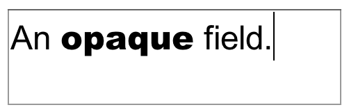
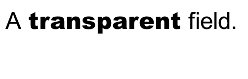

# HyperTalk Java

A toy implementation of Apple's HyperCard written in Java. Originally developed as a class project for a graduate-level compiler design course at DePaul University, Chicago.

#### What's HyperCard?

Released in 1987 and included in the box with every Macintosh sold in the late 80's and 90s, HyperCard was an [Erector Set](https://en.wikipedia.org/wiki/Erector_Set) for building software: part programming language, part "paint" program, part database. With HyperCard, you could draw a user interface with [MacPaint](https://en.wikipedia.org/wiki/MacPaint)-like tools, then apply scripts and behaviors to it using an expressive syntax that mimicked the English language.

Apple called it "programming for the rest of us."

[Watch an interview of HyperCard's creators](https://www.youtube.com/watch?v=BeMRoYDc2z8) Bill Atkinson and Dan Winkler on The Computer Chronicles, circa 1987. Or, watch a screencast tutorial, [here](https://www.youtube.com/watch?v=AmeUt3_yQ8c).

## Features

HyperTalk Java is attempt to recreate HyperCard's functionality in Java. It presently supports these features:

* Create, save and open stacks of cards containing graphics, buttons and text fields. Cards support a foreground and background layer; buttons come in a variety of styles similar to HyperCard's (including radio buttons, checkboxes and combo-box menus); text fields can contain rich (formatted) text.
* Buttons, fields, cards, background and stacks are scriptable in the HyperTalk language. Messages are trappable and follow HyperCard message passing order.
* The full suite of original MacPaint-like tools, patterns, and 2D transforms (i.e., perspective, distort, rotate, invert); integrates with the system clipboard to provide cut-and-paste between applications.
* Much of the HyperTalk language has been implemented including a variety of commands (`ask "How are you today?"`, `sort the lines of bkgnd field 13`); flow control constructs (`if`, `repeat`); part properties (`the width of me`, `the textFont of`); event messaging (`send doSomethingCool to card button id 1`); built-in and user-defined functions and script handlers (`the mouseLoc`, `the long date`); and compound prepositional text chunk operations (`put the first word of "Hello World" after the second item of the third line of card field "data"`).
* UI design maintains high fidelity to original software with window, palette and menu structure similar to HyperCard.

### Notable absences

This is not a HyperCard replacement nor is it an open-sourced release of Apple's software. HyperTalk Java is still missing quite a few features present in HyperCard:

* Can't open or import HyperCard stacks.
* No Home stack; no concept of user levels; no ability to inherit behavior from other stacks (`start using ...`).
* No ability to modify the menu bar; no sound or `play` command.
* No support for external commands or functions (XCMDs/XFCNs).
* Not all commands and functions in HyperTalk have been implemented.

## Getting started

Getting started is easy. What is it that you're interested in doing?

#### I want to download and play with this.

Lucky for you, an executable will be available for download soon.

#### I'm a Java developer and want to contribute to the source code.

Glad to have you aboard! Have a look at [the build instructions](doc/BUILDING.md).

#### I don't care about your dumb homework assignment. I want to run the real HyperCard.

Use the SheepShaver emulator to run Macintosh System Software on newer Macs and PCs. See [this tutorial](https://jamesfriend.com.au/running-hypercard-stack-2014) for details.

#### I'm an attorney and looking for new work.

This project represents a homework assignment gone awry and is in no way associated with Apple's long-obsolete, HyperCard application program. HyperCard&trade;, HyperTalk&trade; and any other trademarks used within are the property of Apple, Inc. and/or their rightful owner(s).

# The HyperTalk Language

[Stacks](#stacks-of-cards) | [Scripts](#scripts-and-handlers) | [Containers](#containers) | [Parts](#parts-and-properties) | [Expressions](#chunk-expressions) | [Visual Effects](#visual-effects) | [Commands](#commands) | [Functions](#functions) | [If-Then](#control-structures) | [Repeat](#loop-constructs)

HyperCard's native language, called _HyperTalk_, is an event-driven scripting language. Scripts are associated with user interface elements called _parts_ and are triggered by user actions called _events_. There is no singular "main" script that executes at startup.

HyperTalk is a [duck-typed](https://en.wikipedia.org/wiki/Duck_typing) language. Internally, each value is stored as a string and converted to an integer, float, boolean, or list depending on the context of its use. Unlike Perl, HyperCard does not allow nonsensical conversions. Adding `5` to `hello` for example, produces a syntax error.

Apple's HyperTalk was case insensitive, but certain keywords in this version are not. For example, `the mouseLoc` returns the coordinates of the mouse, but `the MOUSELOC` yields an error. Comments are preceded by `--`.

A simple script to prompt the user to enter their name then greet them might look like:

```
-- This is my first script

on mouseUp
  ask "Tell me your name" with "I'd rather not"

  if it is "I'd rather not" or it is empty then
    answer "Then I can't very well say hello, can I?"
  else
    put "Hello " && it into greeting
    answer greeting with "Why, thanks!"
  end if

end mouseUp

```

Although indentation and most whitespace is ignored, newlines have meaning in the syntax and are somewhat analogous to semicolons in C-like languages; statements must be separated by a newline, and a single statement cannot usually break across multiple lines.

For example, this is legal:

```
answer "How are you today" with "Pretty good" or "Stinky!"
```

... but this is not:

```
answer "How are you today" with
  "Pretty good" or
  "Stinky!"
```

Apple's HyperCard supported a newline character (_logical negation_ symbol, [Unicode U+00AC](https://en.wikipedia.org/wiki/Latin-1_Supplement_(Unicode_block))) that could be used to break a long statement across multiple lines; this implementation does not.

As you enter script text into the script editor, HyperTalk Java will flag syntax errors as you type by underlining the offending text with a red squiggle.

## Stacks of Cards

A HyperCard stack consists of one or more cards grouped together in an ordered list (like a stack of index cards or a Rolodex) with only one card ever visible at any given time. When the user navigates from one card to another, the contents of the new card appear in place of the old card (and the transition may be animated using a `visual effect` specification).

Every card is comprised of two layers of graphics and interactive user interface elements: a background layer and a card layer (foreground). Each card has a unique foreground, but its background can be shared between multiple cards.

### Navigating between cards

Navigate between cards in the stack using commands in the "Go" menu ("First", "Next", "Prev" and "Last") or use the HyperTalk `go` command:

```
go [to] <destination>
```

Where:

```
<destination>   :== { card | cd | background | bkgnd } <expression>
                | [the] <ordinal> { card | cd | background | bkgnd }
                | [the] <position> { card | cd | background | bkgnd }
<ordinal>       :== first | second | third | ... | tenth
<position>      :== this | first | last | next | prev | previous
```

For example, you can navigate to a specific card,

```
go to card "MyCard" -- navigates to next card named "MyCard"
go to card 13 -- no effect if there are fewer than 13 cards
go next card
go to the third card
go to card id 7
```

You can also navigate to a card based on background,

```
go to the next background -- next card in the stack with a different background than current card
go to background 3 -- first card with the third unique background in the stack
```

## Scripts and Handlers

In HyperCard, stacks, backgrounds, cards, buttons and fields can be scripted in the HyperTalk language. A script is a set of _handlers_ and _functions_ that describe how the part reacts when HyperCard (or another script) sends a message to it.

A handler is a list of statements that execute when the handler's name is passed as a message to the part containing it. A function, like its counterpart in other imperative languages, accepts zero or more arguments, executes zero or more statements, and optionally returns a single value.

For example, a button might contain the script:

```
on mouseUp
  answer "Hello World" with "Why, thank you."
end mouseUp
```

In this example, when the user clicks the button containing this script the action of the mouse button being released over the part causes HyperCard to send the message `mouseUp` to the button. Upon receipt of this message, the button executes its `mouseUp` handler (which, in turn, generates a "hello world" dialog box).

In addition to `mouseUp`, HyperTalk Java automatically sends the following messages to parts:

 Event Message      | Description
--------------------|-----------------------------------------------------------------------------
 `mouseUp`          | Sent when the mouse is pressed and released over a part
 `mouseDown`        | Sent when the mouse is pressed over a part
 `mouseDoubleClick` | Sent when the mouse is double-clicked over a part
 `mouseEnter`       | Sent when the cursor enters the bounds of a part
 `mouseLeave`       | Sent when the cursor leaves the bounds of a part
 `keyDown`          | Sent when a key is typed over a focused part
 `arrowKey`         | Sent when an arrow key is pressed
 `commandKeyDown`   | Sent when the command key (the `meta` key, on non-macOS systems) is pressed
 `controlKey`       | Sent when the control key is pressed
 `enterKey`         | Sent when the enter key is pressed over a part
 `enterInField`     | Sent when the enter key is pressed while typing in a field
 `returnInField`    | Sent when the return key is pressed while typing in a field
 `functionKey`      | Sent when a function (i.e, F1) key is pressed
 `returnKey`        | Sent when the return key is pressed over a part
 `tabKey`           | Sent when the tab key is pressed

Not all messages need originate from HyperCard. A script may send a message to itself or to another part using the `send` command. When using `send` to originate a message, the message need not be a known HyperCard message (i.e., one listed in the table above); it's acceptable to send a message of the author's own creation.

For example:

```
send mouseUp to button 1   -- Make 'button 1' act as though user clicked it
send doSomethingCool to field "myField" -- call the 'on doSomethingCool' handler
```

Parts do not need to implement a handler for every message they might receive. Messages for which no handler exists are simply ignored.

### Message passing order

Messages sent to a part follow a _message passing order_. If a part receives a message and does not have a handler which handles it (or, if its handler invokes the `pass` command) then the message is forwarded to the next part in the sequence.

Messages follow this order:

A **button** or **field** passes messages to the **card** or **background** on which it appears; a card passes messages to its **background**; and a background passes messages to its **stack**. If the stack does not trap the message, it is passed back to **HyperCard** which handles the message itself.

This enables parts to "override" certain HyperCard behaviors by trapping the associated event message (like overriding the behavior of a what a given menu item does by trapping the `doMenu` message).

For example, add the following script to a field to disallow entry any of any character other than an even number:

```
on keyDown theKey
	if theKey is a number and theKey mod 2 is 0 then pass keyDown
end keyDownInField
```

This works by passing the `keyDown` through the message passing order only when the pressed key (`theKey`) is a number that is evenly divisible by 2. By implementing a `keyDown` handler and only conditionally passing the message back to HyperCard (`pass keyDown`), the script can "steal" these key press events and prevent their normal behavior (which would be to add the character to the field).

## Containers

A _container_ is any entity in HyperCard that can hold a value; all parts, variables, properties and the message box are containers.

Local variables in HyperTalk are lexically scoped and implicitly declared. That is, they retain their value only within the handler or function in which they're used. A variable may be made global by explicitly declaring it as such with the `global` keyword. Variables that are not declared as global are considered local, even when a global variable of the same name exists. All variables, global and local, are implicitly initialized with the empty string.

HyperTalk uses `--` to initiate a single-line comment (there is no multi-line comment syntax). Comments can appear on their own line or following a statement, inline. It's also legal for comments to appear outside of function definitions and handlers.
For example:

```
--
-- Global variable example script
--

on mouseUp
  global aVar
  put 5 into aVar

  f() -- call function f with no arguments
  y() -- call function y with no arguments
end mouseUp

function f
  put aVar	-- puts the empty string ("") into the message box
end f

function y
  global aVar
  put aVar	-- puts "5" into the message box
end y
```

Parts can also be used to store value like a variable. When placing a value into a field, the text of the field itself is changed. When placing a value into a button, card, background or stack, the part's `contents` property is changed (the `contents` property does not affect the button's appearance in any way and can be seen/edited from the "Info..." dialog associated with the part in the "Objects" menu).

For example:

```
put 35 + 27 into field id 12          -- Changes the text of this field to "62"
put 35 + 26 into button "My Button"   -- Changes the contents of this button to "62"
put the name of button myButton into the message box
put "Button " && buttonTitle into the name of button id 1
```

Note that HyperTalk contains an implicit variable named `it`. Most expressions and some commands mutate the value of this variable so that it always contains the most recently evaluated result. In this implementation, the value of `it` may also be retrieved using `the result` function (this is not true in Apple's HyperCard).

For example:

```
on mouseUp
  ask "How are you, fine sir?"
  put it into responseVar            -- 'it' contains the user's input
  put the result into responseVar    -- same effect as previous line
end mouseUp
```

## Parts and Properties

A _part_ is a scriptable user interface element. Buttons, fields, cards, backgrounds and the stack itself are parts.

A part maintains a set of _properties_ that describe various aspects of the part like its name, id, size and location. Modifying a part's properties modifies the way it appears and behaves.

HyperTalk Java treats properties as "first class" containers which may be accessed in whole or by chunk using the `get`, `set` or `put` commands (this was not quite true in HyperCard).

### Referring to Parts

Parts may be addressed in HyperTalk by name, number, or ID, and a part can refer to itself as `me`. Use the "Button Info..." and "Field Info..." commands from the "Objects" to view the name, number and ID assigned to a part.

#### Part IDs

Each part in the stack is assigned a unique ID which never changes and will never be reused (even after the part is deleted). A part can be referred to in script by its ID. For example:

```
hide card button id 0
put "I like IDs" into background field id 22
```

#### Part Numbers

Each part is assigned a number that represents it's logical order within the context of the part's owner.

For buttons and fields, this represents the drawing order of the part (z-order); Higher numbered parts are drawn before lowered numbered parts and thereby appear behind them. You cannot directly change a button of field's number, but using the "Bring Closer" or "Send Further" commands from the "Objects" menu will affect the number assigned to it.

For cards and backgrounds, their number represents their position in the stack. Card 1 is the first card in the stack, card 2 is the second and so forth. Backgrounds are similarly numbered by their first appearance in the stack.

You can refer to fields and buttons by their number relative to all parts on the same layer of the card (`background part 14`) or relative only to other parts of the same type (`bkgnd button 13` or `bkgnd field 3`).

```
add 20 to the height of card button 1.
set the name of background part 9 to "Number 9"   -- might be a card or a field
```

#### Part names

Every part has a name which can be edited by the user or changed via script. Parts do not need to have unique names. However, be aware that when referring to a part by name, the part with the lowest number will be assumed if there are multiple parts with requested name.

```
get the height of background button "My Neat Button"
put "2 * 2 = 4" after card field "Math"
```

### Properties common to all buttons and fields

All buttons and fields have these properties:

Property      | Description
--------------|------------
`enabled`   | Returns or sets whether the button or field is enabled (a Boolean value). When disabled, the part appears "grayed out". Note that disabled parts continue to receive user interface generated messages such as `mouseUp` or `mouseEnter`. May also be set with the `enable` and `disable` commands.
`script`      | Retrieves or replaces the current script of the part
`id`          | Returns the part's id. Each part has a globally unique id that is assigned by HyperCard at creation and cannot be changed.
`name`        | Returns or sets the script-addressable name of the part (on buttons, this value determines the label or text that appears drawn on the button)
`location`    | Returns or sets the center point of the part. Also available as the `loc` property.
`left`        | Returns or sets the left-most border of the part's location, moving the part horizontally but not affecting its width.
`right`       | Returns or sets the right-most border of the part's location, moving the part horizontally but not affecting its width.
`top`	        | Returns or sets the top-most border of the part's location, moving the part vertically but not affecting its height.
`bottom`      | Returns or sets the bottom-most border of the part's location, moving the part vertically but not affecting its height.
`topLeft`     | Returns or sets the top-left coordinate of the part. When set, this property adjusts the part's position on the card but does not affect its `height` or `width`. This property only accepts a _point_ value consisting of a comma-separated _x_ and _y_ coordinate, for example, `"10, 100"`
`bottomRight` | Returns or sets the bottom-right coordinate of the part. When set, this property adjusts the part's position on the card but does not affect its `height` or `width`. This property only accepts a _point_ value consisting of a comma-separated _x_ and _y_ coordinate, for example, `"10, 100"`
`width`       | Returns or sets the width of the part (in pixels)
`height`      | Returns or sets the height of the part (in pixels)
`rectangle`   | Returns or sets the rectangle of the part, equivalent to getting or setting the `top`, `left`, `height` and `width` properties together. This property only accepts a _rectangle_ value, consisting of two, comma-separated point coordinates representing the top-left and bottom-right positions of the part, for example `"10, 10, 100, 100"`. This value is also accessible as `rect`.
`visible`     | Returns or sets the visibility of the button (a Boolean value). When invisible, the button is not drawn on the screen and receives no messages from the UI. Can also be set using the `hide` and `show` commands.
`textSize`    | Returns or sets the size (in points) of the part's text.
`textFont`    | Returns or sets the font (family) of the part. Uses the system default font if the specified font family does not exist.
`textAlign`   | Returns or sets the text alignment of the part; one of `left`, `right` or `center`. Assumes `center` if any other value is provided.
`textStyle`   | Returns or sets the text style attributes of the part. Valid style attributes include `plain`, `bold`, `italic`. Provide a list to set multiple attributes together (i.e., `set the textStyle of me to "bold, italic"`)
`selectedText`| For fields, returns the currently selected text. For buttons, returns the selected menu item of `menu`-style buttons or the empty string for all other button styles. This property is read-only; it cannot be set via HyperTalk.

### Buttons

Buttons come in a variety of _styles_ which affect their look-and-feel as well as their behavior. This implementation supports the following button styles:

Style                                    | Name          | Notes
-----------------------------------------|---------------|------------
       | `default`     | A typical push button whose style matches that of the operating system.
       | `classic`     | A push button drawn in the style of Mac OS Classic.
        | `shadow`      | A push button drawn with a drop-shadow decoration.
 | `oval` | A push button drawn with an oval border.
   | `rectangular` | A push button drawn with a rectangular border.
   | `transparent` | A push button drawn without any decoration or border; can be placed atop of graphics on the card to make any region of the card "clickable"
         | `opaque`      | A rectangular push button drawn without a border.
      | `checkbox`    | A checkbox drawn in the style provided by the operating system. When `autohilite` is true and the `family` property is an integer value, then clicking this button will cause the `hilite` of all other buttons in the family to become `false` and the `hilite` of this button to become true.
         | `radio`       | A radio button drawn in the style provided by the operating system. When `autohilite` is true and the `family` property is an integer value, then clicking this button will cause the `hilite` of all other buttons in the family to become `false` and the `hilite` of this button to become true.
          | `menu`        | A drop-down (_combo box_) menu drawn in the style provided by the operating system. Each line of the button's contents are rendered as a selectable menu item.

In addition to the properties common to all parts, a button has these additional properties:

Property    | Description
------------|------------
`style`     | Sets or retrieves the button style. Button styles are described in the table above.
`contents`  | Returns or sets the value of this object, as set or retrieved via HyperTalk's `put` and `get` commands. For example, `put "hello" into button id 0` sets the contents of the button to "Hello". This value could be retrieved with `get the contents of button id 0`.
`showName`  | Returns or sets the visibility of the button's name (a Boolean value). When false, the button is drawn without a name.
`hilite`    | Returns or sets whether the button is drawn "highlighted"; for checkbox and radio styles, hilite describes whether the checkbox is checked or the radio button is selected; for other styles, `hilite` describes a "pressed" state--a highlight typically drawn while the user holds the mouse down over the part. This property has no effect on menu buttons.
`autoHilite`| Returns or sets whether the button's `hilite` property is managed by HyperCard. When `autoHilite` is `true`, checkbox and radio buttons automatically check/uncheck when clicked, and other styles of buttons highlight when the mouse is down within their bounds.

### Fields

In this implementation, fields come in only two flavors: transparent and opaque:

Style                                        | Name          | Notes
---------------------------------------------|---------------|------------
       | `opaque`      | An opaque, etched-border editable text field that can be filled with formatted text.
 | `transparent` | Functionally identical to an opaque field, but whose background and border is transparent.

A field has these properties:

Property   | Description
-----------|------------
`text`     | Returns or sets the text contained within this field
`visible`  | Returns or sets the visibility of the field (a Boolean value). When invisible, the field is not drawn on the screen and receives no messages from the UI.
`lockText` | Returns or sets whether the text contained by the field can be edited by the user.
`showLines`| Returns or sets whether dotted baselines are drawn underneath the text (imitates ruled notebook paper)
`dontWrap` | Returns or sets whether text automatically breaks (wraps) at the visible edge of the field. When false, the field will scroll horizontally until a newline is reached.

### HyperCard Properties

Some properties apply to HyperCard at large (instead of just an individual part). The syntax for setting or getting a global property is similar to part properties. For example:

```
set the itemDelimiter to ","
get the itemDelimiter
```

This implementation supports these HyperCard properties:

Global Property | Description
----------------|---------------
`lockScreen`    | A boolean value indicating whether or not the screen is locked. Reset to false at idle. See the "Visual Effects" section for more details.
`itemDelimiter` | A character or string used to mark the separation between items in a list. HyperCard will use this value anywhere it needs to treat a value as a list. For example, `set the itemDelimiter to "***" \n get the second item of "item 1***item 2***item 3" -- yeilds 'item 2'`. Note that this value has no effect on _point_ or _rectangle_ list items (i.e., when getting or setting the `rect`, `topLeft` or `bottomRight` of a part, the coordinates will always be separated by a comma irrespective of the current `itemDelimiter`).

## Chunk Expressions

HyperCard contains a rich expression language that includes support for complex prepositional chunk operations. A script can fetch or mutate a range of words, characters, lines, or comma-delimited items in a value (called a _chunk_). Chunks may be specified numerically (`line 3 of`), by ordinal (`the third line of`), or relatively (`the last line of`; `the middle word of`).

Chunk expressions follow the form:

```
::= [the] { <ordinal> | <relation> } <chunk> of <value>
|   <chunk> <integer> of <value>
|   <chunk> <integer> to <integer> of <value>
```

Where:

```
<chunk>    ::= char | character | word | item | line
<relation> ::= middle | last
<ordinal>  ::= first | second | third | ... | tenth
```

Consider the following chunked expressions:

```
the first character of the second word of the last line of field id 24
character 19 to 27 of the message box
the second item of "Hello,Goodbye" -- yields "Goodbye"
the middle word of "one two three" -- yields "two"
```

When mutating a chunk of text within a container (using the `put` command), a preposition (`before`, `into`, or `after`) may be included in the expression. For example:

```
put word 2 of "Hello Goodbye" into the first word of field id 0
put "blah" after the third character of the middle item of myVar
put 29 before the message box
```

Want to impress your friends? HyperTalk lets you to modify a chunk-of-a-chunk of text within a container. For example:

```
put x into the second character of the third word of the fourth line of field id 1
put the first char of the second word of x into the middle item of the last line of y
```

## Arithmetic and Logical Expressions

HyperTalk supports a standard suite of mathematical, text and logical operators, including the following (all operators are binary, excepted where otherwise noted):

|Precedence  | Operator        | Description
|------------| ----------------|-------------
|1 (highest) | `( )`           | Grouping
|2           | `-`             | Negation for numbers (unary)
|            | `not`	      | Negation for boolean values (unary)
|3           | `^`             | Exponentiation for numbers
|4           | `*`             | Multiplication for numbers
|            | `/`             | Division for numbers
|            | `div`	      | Division for numbers
|            | `mod`	      | Modulus division for numbers; returns the remainder
|5           | `+`             | Addition for numbers
|            | `-`             | Subtraction for numbers
|6           | `&`, `&&`       | Text concatenation; `&&` adds a space between operands; `&` does not
|7           | `>`             | Greater than comparison for numbers and text
|            | `<`             | Less than comparison for numbers and text
|            | `<=`            | Less than or equal to comparison for numbers and text
|            | `>=`            | Greater than or equal to comparison for numbers and text
|            | `contains`      | Substring comparison for text
|            | `is a`, `is an` | Determines if the left-hand value is a `number`, `integer`, `date`, `point`, `rect` (or `rectangle`), `logical` (or `boolean`, `bool`). Returns an error if the right-hand value is not an expression yielding one of these types.
|            | `is not a`, `is not an` | The logical inverse of `is a`, `is an`
|8           | `=`             | Equality comparison for text
|            | `is`            | Equality comparison for text
|            | `is not`        | Negative equality comparison for text
|            | `<>`	      | Synonym for is not
|9           | `is within`     | Determines if the left-hand point value is contained within the right-hand rectangle value.
|            | `is not within` | Determines if the left-hand point value is not contained within the right-hand rectangle value.
|10          | `and`           | Logical AND for boolean values
|11 (lowest) |  `or`           | Logical OR for boolean values

HyperCard uses the following order (top to bottom) to evaluate factors and terms in an expression:

Precedence   | Term                    | Description
-------------|------------------------|------------
1 (highest)  | `empty`                 | Keyword expression representing the empty string (e.g., `if x is empty`)
2            | _Built-in Function_     | Evaluation of a built-in function (e.g., `the mouse`)
3            | _User-defined Function_ | Evaluation of a user-defined function (e.g., `fact(10)`)
4            | _Literal_               | Evaluation of a literal value (e.g., `"Hello world!"`)
5            | _Variable Container_    | Evaluation of a variable container (e.g., `x` in `get x + 3`)
6            | _Part_                  | Evaluation of a part specifier (e.g., `card field id 0`)
7 (lowest)   | _Property_              | Evaluation of a property of a part (e.g., `the width of me`)

This implementation supports nearly the full expression language (all of the aforementioned operators), and follows the same order of precedence as Apple's HyperTalk.  

Valid expressions include:

```
item 1 of the mouseLoc < 100 -- true if the mouse is towards the left of the card
4 * (2 + 3) -- yields 20
"hello" contains "el" and "goodbye" contains "bye" -- true
3 * 5 is not 15 -- false
"Hello" && " World" -- produces "Hello World"
"Hyper" > "Card" -- true, "Hyper" is alphabetically after "Card"
not "nonsense" -- syntax error, "nonsense" is not a boolean
false is not "tr" && "ue" -- true, concatenating 'tr' with 'ue' produces a logical value
```

## Visual Effects

HyperCard provided a selection of visual effects that could be applied to card-to-card transitions or when "revealing" changes made by a script. HyperTalk Java provides a similar set of visual effects.

A script can "lock" the screen to prevent the user from seeing what the script is doing. As long as the screen is locked, the user will see no changes made to the card or stack until HyperTalk Java is idle (has no more pending scripts to execute) or the `unlock screen` command is executed.

For example, consider this script which secretly navigates to the next card in the stack, draws a diagonal line on it, and then navigates back. While this script executes, the user has no knowledge that "behind the scenes" we've moved to another card and modified it.

```
on mouseUp
  lock screen
  go to the next card
  choose brush tool
  drag from 50,50 to 200,200
  go prev
  unlock screen  -- not required; screen will unlock automatically upon completion
end mouseUp
```

When navigating between cards or unlocking the screen, a *visual effect* can be applied to animate the change. HyperTalk Java supports these animations:

Visual Effect         | Description
----------------------|-----------------------------------------
`dissolve`            | Cross-dissolve from one card image to the next.
`checkerboard`        | Destination card image appears in a 8x8 matrix.
`venetian blinds`     | Destination appears in "louvered" horizontal stripes.
`scroll left`         | Scroll from right to left.
`scroll right`        | Scroll from left to right.
`scroll up`           | Scroll from bottom to top.
`scroll down`         | Scroll from top to bottom.
`wipe left`           | Slides the resulting image over the source from right to left.
`wipe right`          | Slides the resulting image over the source from left to right.
`wipe up`             | Slides the resulting image over the source from bottom to top.
`wipe down`           | Slides the resulting image over the source from top to bottom.
`zoom open`           | The resulting card image expands over the source in a rectangle aperture.
`zoom close`          | The resulting card collapses over the source in a rectangle aperture.
`iris open`           | The resulting card image expands over the source in a circular aperture.
`iris close`          | The resulting card image collapses over the source in a circular aperture.
`barn door open`      | The source image is split horizontally and each side slides out left/right to expose the resulting image.
`barn door close`     | The resulting image slides in the from the left/right obscuring the source image.
`shrink to bottom`    | The source image shrinks downward exposing the destination.
`shrink to top`       | The source image shrinks upward exposing the destination.
`shrink to center`    | The source image shrinks from the center of the screen exposing the destination.
`stretch from bottom` | The destination image grows from the bottom obscuring the source underneath it.
`stretch from top`    | The destination image grows from the top obscuring the source underneath it.
`stretch from center` | The destination image grows from the center of the screen obscuring the source underneath it.

The syntax for specifying a visual effect is:

```
visual [effect] <effect-name> [to <image>] [speed]
```

Where `<effect-name>` is the name of a visual effect (from the table above); `<image>` is one of `card`, `gray`, `black`, `white` or `inverse` (of the destination card) and speed is one of `fast`, `slow`, `slowly`, `very fast` or `very slow`.

A visual effect can be applied when unlocking the screen or when navigating between cards. For example:

```
unlock screen with visual effect dissolve
go next with visual barn door open slowly
go to card 3 with visual effect iris open to black very fast
```

## Commands

This version of HyperCard implements the following set of commands:

Command	      | Description
--------------|------------
`put`         | Places a value into a container or into a chunk of a container; `put "hello" into the third item of mylist`. When no container is specified, the message box is implied as the default container. Note that HyperCard does not allow "putting" a value into a property, but this implementation does, for example: `put item 1 of the mouseLoc into item 1 of the location of me`.
`get`	        | Get the value of a part's property and places it into the implicit variable it; `get the visible of button id 0`
`set`	        | Sets the property of a part to a value (`set the wraptext of field id 3 to (5 > 3)`) or sets a global HyperCard property (`set the itemDelim to "*"`). If no such property exists, the given expression is placed into a container (variable) of that name.
`go`          | Transitions to a new card; `go to card 1` or `go next` or `go to the last card`
`wait`        | Waits for the specified condition or for the given amount of time. Follows the syntax `wait { [for] <count> { ticks `&#124;` seconds } `&#124;` until <condition> `&#124;` while <condition> }`. Valid examples include: `wait for 3 seconds`, `wait until the mouse is down`, `wait while the message box contains "hello"`
`answer`      | Produces a dialog box with a message and up to three user-defined buttons. Follows the syntax `answer <message> [with <button1> [or <button2>] [or <button3>]]]`. Upon completion, it contains the text of the button selected by the user, or the empty string if answer is used without an optional button specifier.
`ask`	        | Similar to answer, but produces a dialog box with a message and a user-editable response string. Follows the syntax `ask <message> [with <answer>]`. Upon completion, it contains the value of the user-editable text field, or the empty string if the user cancelled the dialog.
`do`          | Executes a value as if it were a list of statements; `do "put 2+3 into the message window"` or `do the text of field myscript`
`send`        | Send a message to a part on the current card; `send "mouseUp" to field id 3`
`add`         | Adds a value to a container; for example `add 3 to x` or `add card field id 0 to card field id 1`
`subtract`    | Subtracts a value from a container; `subtract (10 * 3) from item 2 of field "items"`
`multiply`    | Multiplies a container by a value; `multiply x by 3`
`divide`      | Divides a container by a value; `divide x by it`
`choose`      | Selects a tool from the tool palette; `choose brush tool` or `choose tool 7`. Acceptable tool names and their corresponding numbers are as follows: `browse` (1), `oval` (14), `brush` (7), `pencil` (6), `bucket` (13), `poly[gon]` (18), `button` (2), `rect[angle]` (11), `curve` (15), `reg[ular] poly[gon]` (17), `eraser` (8), `round rect[angle]` (12), `field` (3), `select` (4), `lasso` (5), `spray [can]` (10), `line` (9), or `text` (16).
`click`       | Clicks the mouse at a provided location on the card, while optionally holding down one or more modifier keys; `click at "10, 10"` or `click at "130,220" with shiftKey, commandKey`. Valid modifier keys are `shiftKey`, `optionKey` and `commandKey`.
`drag`        | Drags the mouse from one point to another while optionally holding down one or more modifier keys; `drag from "35,70" to "200,180" with shiftKey`
`type`        | Emulates the user typing a sequence of characters at the keyboard. For example, `type "Hello world!"`. Add `with commandKey` to simulate typing a control sequence, for example, `type "v" with commandKey` to invoke the "Paste" command from the "Edit" menu.
`sort`        | Sorts the `lines` or `items` of a container based on value or expression using the syntax `sort [[the] {items | lines} of] <container> [{{ascending | descending} | by <expression>}]` For example, `sort field id 0` or `sort the items of myContainer descending` or `sort lines of myField by the third character of each`. In the last syntax form, a local variable called `each` is implicitly declared and contains the chunk (the line or item) that is being compared.
`hide`        | Makes a part invisible on the card, for example `hide button id 0` (has the same effect of setting the `visible` property of the part to false, i.e., `set the visible of button id 0 to false`)
`show`        | Makes a part visible on the card, for example `show button "My Button"`.
`delete`      | Deletes a specified part, for example `delete card button id 0`, `delete bkgnd field "Report"`
`enable`      | Enables a part on the card; sets the part's `enabled` property to true.
`disable`     | Disables a part on the card causing it to be drawn in a "greyed-out" state; sets the part's `enabled` property to false.  
`lock screen` | "Locks" the screen until HyperTalk Java is idle or the screen is unlocked explicitly via the `unlock screen` command.
`unlock screen [with visual [effect] <effect-name> [to <image>] [<speed>]]` | Unlocks the screen while optionally applying a visual effect to the revealed changes. See the "Visual Effects" section of this document for details.

## Functions

HyperCard provides both a suite of built-in functions as well as the ability for a user to script new ones. Note that the calling syntax differs between built-in and user-defined functions.

### Built-in Functions

There are several equivalent syntax forms that can be used when invoking a built-in function:

* For built-in functions that accept a single argument, use `[the] <function> { of | in } <argument>` or `<function> ( <argument> )`
* For built-in functions that don't accept any arguments, use `[the] <function>`. Note that you cannot invoke a no-argument built-in as `<function>()` as you might in C or Java.
* For built-in functions that accept multiple arguments, use `function(<arg1>, <arg2>, ...)`.

This implementation includes the following built-in functions:

Function | Description
---------|-------------
`average`	| Returns the statistical mean of a list of numerical items. Example: `the average of "1,2,3,4,5"` (returns 3) or `average (93, 26, 77)` returns 65.33.
`mouse` | Returns the current state of the left mouse button; either "up" or "down"
`mouseLoc` | Returns the current location of the cursor (in coordinates relative the top-left corner of the card panel), for example: `the mouseLoc` returns "123,55"
`mouseH` | Returns the x-coordinate of `the mouseLoc`; the number of pixels the mouse cursor is from the left border of the card.
`mouseV` | Returns the y-coordinate of `the mouseLoc`; the number of pixels the mouse cursor is from the top border of the card.
`clickLoc` | Returns the coordinate of the last location the user clicked the mouse.
`clickH` | Returns the x-coordinate of the last location the user clicked the mouse.
`clickV` | Returns the y-coordinate of the last location the user clicked the mouse.
`tool` | Returns the name of the currently selected tool. Example: `if the tool is "brush" then answer "You chose the paint brush!"`
`shiftKey` | Returns the current state of the shift key, either `up` or `down`. For example, `wait until the shiftKey is down`
`commandKey` | Returns the current state of the command key (and/or 'ctrl' key on PC hardware), either `up` or `down`. Also available as `the cmdKey`
`optionKey` | Returns the current state of the option key (and/or 'meta' key on Unix hardware), either `up` or `down`. For example, `repeat while the optionKey is up`
`number of words`, `number of chars`, `number of lines`, `number of items` | Returns the number of words, characters, items or lines in a given factor. For example: `the number of characters in "hello"` returns "5"
`number of card parts`, `number of background parts` | Returns the number buttons or field present on the card or background layer, respectively. For example, `repeat with n=1 to the number of card parts`.
`number of card buttons`, `number of card fields` | Returns the number of buttons present on the card layer.
`number of background buttons`, `number of background fields` | Returns the number of buttons present on the background layer.
`result` | Returns the current value of the implicit variable `it`, for example: `the result`
`message`<br>`message box`<br>`message window` | Returns the contents of the message box. For example: `put the message box into aVar`
`min` | Returns the minimum number passed to the function. For example: `min(3,5,7.24,9)` evaluates to 3.
`max` | Returns the maximum number passed to the function. For example: `min(3,5,7.24,9)` evaluates to 9.
`date`<br>`short date` | Returns the current date in _dd/mm/yy_ format. For example `put the date` yields 07/04/16.
`long date` | Returns the current date fully spelled out. For example, Saturday, July 02, 2016.
`abbreviated date`<br>`abbrev date` | Returns the current date  spelled out using abbreviations. For example, Sat, Jul 02, 2016.
`seconds` | Returns the number of seconds since midnight, January 1, 1970 UTC.
`ticks` | Returns the number of ticks (1/60th second) since the JVM was started.
`random` | Returns a random integer between 0 and the given argument. Example: `the random of 100` or `random(10)`.
`sqrt` | Returns the square root of the given argument or `NaN` of the argument is negative.
`sin` | Returns the trigonometric sine of the given argument, represented in radians.
`cos` | Returns the trigonometric cosine of the given argument, represented in radians.
`tan` | Returns the trigonometric tangent of the given argument, represented in radians.
`atan` | Returns the trigonometric arctangent of the given argument, represented in radians.
`exp` | Returns the value of _e_ raised to the power of the given argument.
`exp1` | Returns the value of _1-e_ raised to the number of the given argument.
`exp2` | Returns the value of _2_ raised to the given argument; for example `the exp2 of 3` is equivalent to `2^3`.
`ln` | Returns the natural logarithm of the given argument.
`ln1` | Returns the natural logarithm of the given argument plus one.
`log2` | Returns the base-2 logarithm of the given argument.
`trunc` | Returns the integer portion of the given numerical argument; for example `the trunc of 8.99` yields `8`.
`abs` | Returns the absolute value of the given numerical argument.
`numToChar` | Returns the character value associated with the given character _codepoint_. The actual mapping between numbers and characters will depend on the character encoding used by the system, but `numToChar` is always assured to be the inverse of `charToNum`
`charToNum` | Return the numerical _codepoint_ associated with the given character. The actual mapping between characters and numbers will depend on the character encoding used by the system, but `charToNum` is always assured to be the inverse of `numToChar`
`value` | Evaluates the given factor as a HyperTalk expression and returns the result. Example: `the value of ("3" & "*4")` yields 12.
`length` | Returns the number of characters in the value of the given expression. Example: `the length of "Hello World!"` yields 12.
`selectedText` | Returns the currently selected text within whichever field is in focus, or the empty string if no selection exists. For example, `answer the selectedText`
`clickText` | The last word that was clicked in a text field, or the empty string if no text has been clicked. For example, `put "You clicked " & the clickText`.
`screenRect` | The rectangle of the screen on which the card is displayed, for example `put item 3 of the screenRect into screenWidth`

### User-defined Functions

A user may define a function inside of a script, but user-defined functions cannot be nested inside of other functions or handlers; cannot be accessed outside of the script in which they're defined; and cannot be invoked using the `[the] <function> of ...` syntax.

There is no distinction between a function that returns a value and one that does not (there is no requirement that a function call `return`). If a user-defined function does not invoke `return`, the empty string is implicitly returned.

The syntax for defining a function is:

```
function <functionName> [<arg1> [, <arg2>] ... [, <argN>]]]
  <statementList>
  [return <expression>]
end <functionName>
```

When calling a user defined function, use the calling syntax `<functionName>(<arg1>, <arg2>, ...)`. Note that the number of arguments passed to the function must match the number declared in the definition. HyperTalk does not support function overloading; each function defined in a script must have a unique name.

Consider this recursive function for generating the Fibonacci sequence:

```
on mouseUp
  answer fibonacci("", 0, 1, 200)
end mouseUp

function fibonacci sequence, lastValue, thisValue, maxValue
  if sequence is empty then put "0" into sequence
  put thisValue + lastValue after the last item of sequence

  if thisValue + lastValue <= maxValue then
  return fibonacci(sequence, thisValue, thisValue + lastValue, maxValue)
  else
  return sequence
  end if

end fibonacci
```

## Control Structures

HyperTalk supports simple conditional branching (if-then-else), plus a very flexible syntax for looping. Conditionals have the following syntax:

```
if <expression> then
   <statementList>
[else
   <statementList>]
end if
```

Some examples of conditional branching:

```
if 1 < 2 and 3 < 4 then
  answer "This is true!"
end if
```

```
if the first line of field id 0 contains "hello" then
  put "Hello" into the message box
else
  put "Goodbye" into the message box
end if
```

To address the [dangling else problem](https://en.wikipedia.org/wiki/Dangling_else), HyperTalk does not support a multi-line else-if construct. That said, nesting complex conditional logic can be achieved by nesting `if` statements. For example:

```
ask "Yes, no or maybe?" with ""

if it is "yes" then
  answer "Thank you for your support."
else
  if it is "maybe" then
    answer "Make up your mind already."
  else
    answer "We never liked you anyway."
  end if
end if
```

### Loop Constructs

HyperTalk provides a variety of looping constructs. The overall syntax for each of them is

```
<repeat-construct>
  <statement-list>
end repeat
```

The list of available repeat constructs is defined in the table below:

Repeat Construct | Description
-----------------|------------
`repeat forever` | Executes the enclosed statement-list forever. Sort of. Type `cmd-.` or `ctrl-.` at anytime to break execution of the loop.
`repeat until <expression>` | Executes the enclosed statement-list until the Boolean expression is true; if the expression is initially true, the statement-list will not be executed.
`repeat while <expression>` | Executes the enclosed statement-list as long as the Boolean expression remains true; if the expression is initially false, the statement-list will not be executed.
`repeat [for] <expression> [times]` | Executes the enclosed statement-list a pre-determined number of times.
`repeat with <container> = <expression> down to <expression>` | Executes the enclosed statement-list for as long as the first expression remains numerically greater than the second expression. Decrements the first expression by one each time the loop executes and places the decremented value into the given container.
`repeat with <container> = <expression> to <expression>` | Executes the enclosed statement-list for as long as the first expression remains numerically less than the second expression. Increments the first expression by one each time the loop executes and places the incremented value into the given container.

For example:

```
repeat with myVar = 1 to 10
  answer myVar
end repeat
```

```
repeat while the mouse is down
  set the top of me to item 2 of the mouseLoc
end repeat
```

#### Nu är det slut...
